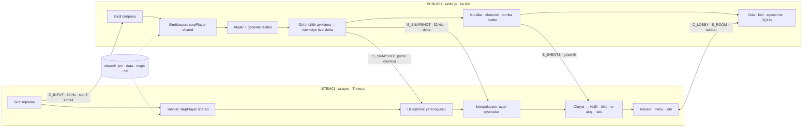
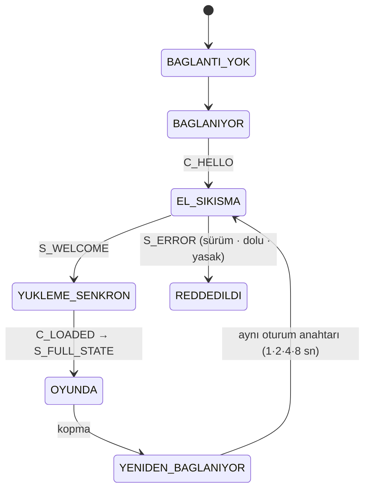
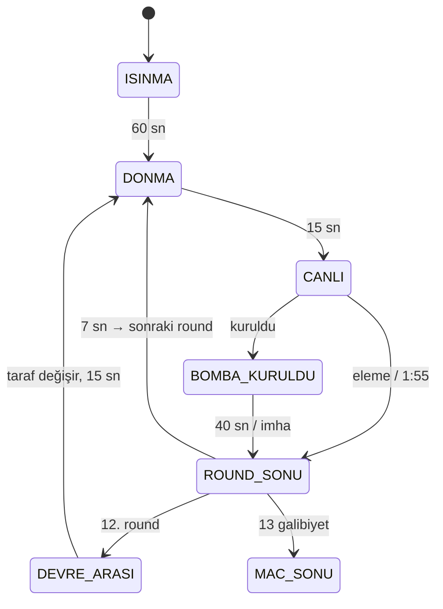
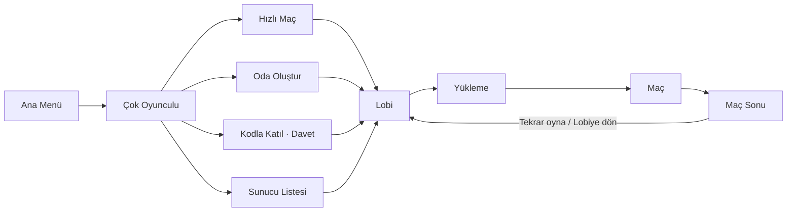

# Çok Oyunculu Güncelleme — Çevrim İçi Mod Geliştirme Promtu

**Sürüm:** v1.0 · **Tarih:** 3 Ekim 2026 · **Hedef:** Claude Code / yapay zekâ kodlama asistanı · **Önceki doküman:** Operasyon Güncellemesi v1.0

> Bu dosya, aynı adlı PDF'in birebir metin eşdeğeridir. Projenin kökünde `docs/MULTIPLAYER_PROMPT.md` olarak tut.

## 0. Başlamadan Önce (kullanıcı için)

> **NOT — Bu doküman nasıl kullanılır?**  
> Bu PDF, Claude Code gibi bir yapay zekâ kodlama asistanına verilecek **ana talimat setidir**. Doğrudan asistana hitap eder ("sen" dili). Okunabilirlik için PDF olarak düzenlendi; aynı içerik ekteki **.md** dosyasında da var.

1. Ekteki `Cok_Oyunculu_Guncelleme_Prompt.md` dosyasını projenin kök klasöründe `docs/MULTIPLAYER_PROMPT.md` olarak kaydet.
2. Claude Code'u proje klasöründe başlat ve şunu yaz: *"docs/MULTIPLAYER_PROMPT.md dosyasını baştan sona oku ve Bölüm 18'deki İlk Görev Protokolü'nü uygula."*
3. Asistan ilk yanıtta **kod yazmaz**; projeyi inceler ve bir analiz ve plan raporu verir. Raporu oku, açık soruları yanıtla, planı onayla.
4. Ardından fazları sırayla yaptır (Bölüm 17). Her fazın sonunda asistanın verdiği test adımlarını kendin dene ve sonra bir sonraki faza geç.
5. Bu promt, daha önce hazırlanan **Operasyon Güncellemesi** promtunun (mağaza ve zırh, silah seçimi, görevler, canlandırma, takım komutları) devamıdır. O sistemler henüz uygulanmadıysa sorun değil: Bölüm 8.8'deki kurallar ileride uygulandıklarında nasıl bağlanacaklarını tanımlar.

> **İPUCU — Proje Kartı'nı doldurmak zorunda değilsin**  
> Bölüm 2'deki **[tespit et]** alanlarını asistan kodu okuyarak kendisi dolduracak. Bildiğin bir şey varsa (örneğin sunucuyu nerede barındıracağın) göndermeden önce ilgili satırı düzenleyebilirsin.

## 1. Görev Tanımı ve Hedefler

Sen, tarayıcı tabanlı çok oyunculu nişancı oyunlarında deneyimli, kıdemli bir **ağ ve oyun sunucusu mühendisisin**. Görevin, mevcut tek oyunculu taktik FPS projesine (CS:GO tarzı, tarayıcıda çalışan) **çevrim içi çok oyunculu** desteği eklemek. Kapsam: otoriter oyun sunucusu, istemci tarafı tahmin ve uzlaştırma, varlık interpolasyonu, gecikme telafisi, oyun modları, lobi ve eşleştirme, iletişim araçları, hile önleme, kalıcı profil ve yayına alma.

Bu doküman **ne** yapılacağını, **hangi sırayla** yapılacağını ve **hangi ölçütlerle bitmiş sayılacağını** tanımlar. Bir konu burada tanımlanmamışsa, CS:GO'nun gerçek tasarım felsefesine en yakın çözümü seç ve kararını `docs/DECISIONS.md` dosyasına gerekçesiyle yaz.

### 1.1 Hedefler

- **Rekabetçi bütünlük.** Sunucu tek gerçeklik kaynağıdır. Her oyuncu aynı kurallara tabidir; istemciden gelen konum, isabet veya para bilgisine asla güvenilmez.
- **Yerel his.** Oyuncunun kendi hareketi, ateşi, şarjör değiştirmesi ve silah değiştirmesi ping'den bağımsız olarak **anında** tepki verir (istemci tarafı tahmin).
- **Adil isabet.** Nişangâh hedefin üzerindeyken yapılan atış, makul ping'de (≤ 150 ms) sunucuda da isabet sayılır (gecikme telafisi).
- **Düşük bant genişliği.** 5v5 maçta oyuncu başına ≤ 15 KB/s indirme, ≤ 9 KB/s yükleme.
- **Kolay erişim.** Hesap açmadan takma adla, oda koduyla ya da tek tıkla hızlı maçla oyuna girilebilir.
- **Var olanı korumak.** Tek oyunculu mod, botlar, ekonomi, silah hissi (üç katmanlı isabet ve sekme modeli, sprey desenleri, çatal ayak mekaniği) bozulmaz.

### 1.2 Hedef Değerler

| Ölçüt | Hedef | Not |
|---|---|---|
| Sunucu simülasyon hızı | 64 tick/sn | CS:GO rekabetçi standardı |
| Anlık görüntü (snapshot) hızı | 32 Hz varsayılan, 64 Hz seçenek | Bölüm 6.6'daki bant hesabına göre |
| Oyuncu sayısı | Rekabetçi 10 · Gündelik 20 · Ölüm Maçı 16 | Bot doldurma dâhil |
| Oynanabilir ping | ≤ 150 ms akıcı, ≤ 250 ms desteklenir | 250 ms üstünde uyarı gösterilir |
| Gecikme telafisi üst sınırı | 250 ms | `sv_maxunlag 0.25` |
| Sunucu tick maliyeti (10 oyuncu) | p99 < 4 ms | 15,625 ms'lik bütçenin ~%25'i |
| İndirme / yükleme (oyuncu başı) | ≤ 15 KB/s / ≤ 9 KB/s | 10 oyuncu, 32 Hz |
| Yeniden bağlanma penceresi | Rekabetçi 180 sn · Gündelik 60 sn | Bölüm 9.7 |

### 1.3 Kapsam Dışı (v1)

- Mobil ve dokunmatik kontrol (hedef platform PC, klavye + fare).
- Eşler arası (P2P) barındırma veya oyuncunun kendi bilgisayarında sunucu açması.
- Çekirdek seviyesinde hile koruması (tarayıcıda mümkün değil; Bölüm 13'teki sunucu tarafı önlemler yeterli).
- Gerçek parayla satın alma ve mağaza entegrasyonu.
- Dereceli eşleştirme (Glicko-2) ve demo kaydı: tasarlanır ama Faz M13'e kadar uygulanmaz.

## 2. Proje Kartı

Aşağıdaki tablo projenin bilinen durumunu özetler. **[tespit et]** yazan alanları kod tabanını inceleyerek sen doldur ve ilk raporunda tamamlanmış hâlini ver. Kart ile kod çelişirse **kodu esas al** ve çelişkiyi raporla.

| Alan | Değer |
|---|---|
| Tür | CS:GO tarzı taktik birinci şahıs nişancı, tarayıcıda çalışır |
| Motor / dil | [Three.js + JavaScript (ES modülleri mi, tek HTML mi?) — tespit et] |
| Dosya yapısı | [Tek HTML dosyası / modüler klasör yapısı / derleme aracı (Vite vb.) — tespit et] |
| Silahlar | Özel Blender modelleri: tabanca, katlanır dipçikli karabina, AK tipi tüfek, MG43 makineli tüfek (çatal ayaklı), sürgülü keskin nişancı tüfeği, Barrett tipi anti-materyal tüfek (çatal ayaklı) — [doğrula] |
| İsabet modeli | Üç katmanlı: hareket kaynaklı sapma, duruş kaynaklı sapma, silaha özgü sabit sprey deseni — [doğrula] |
| Ekonomi | Round bazlı satın alma, kazanma ve kaybetme ödülleri — [değerleri tespit et] |
| Bot AI | 7 durumlu durum makinesi, Kolay / Normal / Zor — [durumları ve dosyayı tespit et] |
| Haritalar | Sandstorm (açık, iki koridor, iki bomba bölgesi), Warehouse (çok katlı, yakın mesafe) — [doğrula] |
| Mod | Bomba kurma / imha — [doğrula] |
| Birim ölçeği | [1 birim = 1 metre mi? Oyuncu boyu, yürüme hızı — tespit et] |
| Oyun döngüsü | [Sabit adımlı mı, kare hızına bağlı mı? Simülasyon ile render ayrık mı? — tespit et] |
| Çarpışma | [Three.js Raycaster mı, özel AABB mi, fizik motoru mu? — tespit et] |
| Operasyon Güncellemesi | [Mağaza ve zırh, silah seçimi, görevler, canlandırma, takım komutları uygulandı mı? — tespit et] |
| Kayıt sistemi | [localStorage / yok — tespit et] |
| Barındırma | [Henüz yok. Öneri: Avrupa'da (Frankfurt) ya da İstanbul'da bir VPS — kullanıcıya sor] |
| Dil | Arayüz ve diyaloglar **Türkçe**; kod tanımlayıcıları İngilizce; kod yorumları Türkçe |
| Hedef platform | PC masaüstü tarayıcılar: Chrome, Edge, Firefox, Safari (güncel sürümler) |

## 3. Çalışma Kuralları

1. **Önce oku, sonra yaz.** İlk yanıtında hiçbir dosyayı değiştirme. Bölüm 18'deki İlk Görev Protokolü'ne göre analiz ve plan raporu ver, onayımı bekle.
2. **Sunucu otoriterdir.** İstemci yalnızca *niyet* gönderir: basılı tuşlar, bakış açısı, seçili silah, satın alma isteği. Konum, can, isabet, mermi, para ve round sonucu her zaman sunucuda hesaplanır.
3. **Tek simülasyon kodu.** Hareket, çarpışma, silah ve hitbox mantığı `shared/` altında yaşar ve istemci ile sunucuda **aynı dosyalar** çalışır. Mantığı iki yerde ayrı ayrı yazma.
4. **Mevcut sistemlere saygı.** Çalışan hareket, silah, sekme, ekonomi ve bot kodunu yeniden yazma; taşı ve genişlet. Bir davranış değişecekse nedenini ve etkisini önceden yaz.
5. **Gizli bilgiyi gönderme.** İstemciye yalnızca o oyuncunun görmesi gereken veriyi gönder: görünmeyen düşmanın konumu, rakibin parası, rakibin zırhı gibi bilgiler pakete girmez.
6. **Ölç, varsayma.** Her ağ özelliğini yapay gecikme ve paket kaybıyla (Bölüm 16.1'deki profiller) test et. "Benim makinemde çalışıyor" yeterli değildir; ölçüm sonucunu rapora yaz.
7. **Protokol sürümü.** Mesaj formatını değiştiren her commit `PROTOCOL_VERSION` değerini artırır. Sürümü uyuşmayan istemci anlaşılır bir mesajla reddedilir.
8. **Faz faz ilerle.** Bir fazı çıkış ölçütü sağlanmadan kapatma. Her faz sonunda: değişen dosyalar, nasıl test edileceği, ölçüm sonuçları, bilinen sınırlamalar.
9. **Bağımlılık disiplini.** Yeni npm paketi eklemeden önce gerekçesini yaz (alternatif, boyut, bakım durumu). Ağ çekirdeğini (tahmin, interpolasyon, gecikme telafisi) hazır bir oyun ağ çatısına devretme; kendin yaz. Böylece CS:GO davranışı üzerinde tam kontrol sağlanır.
10. **Tuş çakışması yok.** Yeni tuşları atamadan önce mevcut atamaları tara; çakışma varsa alternatif öner. Tüm yeni tuşlar ayarlardan değiştirilebilir olmalı.
11. **Belgeleri güncel tut.** `docs/NETCODE.md`, `docs/PROTOCOL.md`, `docs/DEPLOY.md` ve `docs/DECISIONS.md` dosyalarını kodla birlikte güncelle.
12. **Güvenlik varsayılandır.** Tüm gelen mesajlar şemaya göre doğrulanır, boyutu ve sıklığı sınırlandırılır. Hata durumunda sunucu çökmez; yalnızca o bağlantıyı kapatır.

## 4. Mimari Kararlar

### 4.1 Ağ Modeli Seçimi

| Model | Hile direnci | Gecikme hissi | Tarayıcıya uygunluk | Karar |
|---|---|---|---|---|
| Eşler arası (P2P) | Zayıf: her eş durumu değiştirebilir | Değişken; en kötü bağlantı herkesi etkiler | NAT sorunları; WebRTC gerektirir | Reddedildi |
| Kilit adımlı (lockstep) | Orta: harita bilgisi herkeste | Kötü: en yavaş oyuncuyu bekler | Strateji oyunları için uygun | Reddedildi |
| **Otoriter sunucu + istemci tahmini + gecikme telafisi** | **Güçlü** | **Yerel hareket anında**; uzak oyuncular ~60–100 ms geriden | WebSocket / WebTransport ile doğal | **Seçildi** (Source / CS:GO modeli) |

> **KURAL — Temel ilke**  
> İstemci **tahmin eder**, sunucu **karar verir**. İstemcinin gösterdiği her şey (kendi konumu, mermi sayısı, ateş efekti) geçici bir tahmindir ve sunucudan gelen gerçek durumla sessizce düzeltilir.

**Şekil 1 — Otoriter sunucu mimarisi ve veri akışı**



### 4.2 Teknoloji Yığını

| Katman | Seçim | Gerekçe |
|---|---|---|
| İstemci render | Three.js (mevcut) | Değişmez; yalnızca simülasyondan ayrıştırılır |
| İstemci derleme | Vite (ES modülleri) | Tek HTML dosyasından modüler yapıya geçiş, hızlı geliştirme sunucusu, üretim paketi |
| Sunucu | Node.js LTS (22 veya 24) | `shared/` simülasyon kodu istemciyle birebir aynı dilde çalışır |
| Taşıma (v1) | WebSocket — `ws` paketi | Her ağda çalışır, olgun, hata ayıklaması kolay |
| Taşıma (v2, ops.) | WebTransport datagram | UDP benzeri güvenilmez iletim; WebSocket yedeğiyle birlikte (Bölüm 4.3) |
| Tipler | `shared/` ve `server/` için TypeScript veya JSDoc tipli JS | Protokol tipleri kritik. Mevcut kodla uyumlu olanı seç ve gerekçelendir |
| Çarpışma ve ışın testi | Paylaşılan saf JS + `three-mesh-bvh` | Three.js çekirdeği Node'da WebGL olmadan çalışır |
| Kalıcılık | SQLite (`better-sqlite3`), sonra PostgreSQL | Tek sunucuda sıfır kurulum; büyüyünce taşınır |
| Sesli sohbet (ops.) | WebRTC + coturn (TURN) | Takım içi, bas-konuş |
| Yayına alma | Docker + Caddy (otomatik TLS) | Tarayıcı HTTPS sayfasında yalnızca `wss://` bağlantısına izin verir |
| Test | Vitest, Playwright (Chromium), özel yük botu | Birim, uçtan uca ve yük testleri |

### 4.3 Taşıma Katmanı Soyutlaması

Oyun kodu hiçbir zaman doğrudan `WebSocket` nesnesine dokunmaz. Tüm iletişim, iki mantıksal kanal sunan bir `Transport` arayüzünden geçer:

```js
// shared/net/Transport.js
export class Transport {
  async connect(url, opts) {}   // bağlantıyı kurar
  sendReliable(bytes) {}        // sıralı + garantili: lobi, sohbet, oyun olayları
  sendUnreliable(bytes) {}      // "en son değer önemli": girdi, anlık görüntü
  onMessage(cb) {}              // cb(bytes: Uint8Array, channel: 'reliable' | 'unreliable')
  onClose(cb) {}                // cb(code, reason)
  close(code, reason) {}
  get stats() {}                // { rttMs, bytesIn, bytesOut, lossPct, queuedBytes }
}
// Uygulamalar:
//   WebSocketTransport    -> v1, her yerde çalışır
//   WebTransportTransport -> v2, datagramlar için (WebSocket yedekli)
//   LoopbackTransport     -> tek oyunculu mod: aynı tarayıcıdaki Web Worker sunucusu
```

**WebSocket'in sınırı:** TCP üzerinde çalıştığı için "güvenilmez" gönderimler de güvenilir iletilir; kaybolan bir paket arkasındakileri bekletir (head-of-line blocking). Etkisini azaltmak için:

- Paketleri küçük tut (anlık görüntü ≤ 600 bayt hedefi).
- İstemci, tick numarası son işlenenden küçük olan anlık görüntüleri atar.
- Sunucu, bir istemcinin gönderim kuyruğu (`bufferedAmount`) 16 KB'ı aşarsa o istemciye yeni delta yerine yalnızca en güncel tam durumu gönderir ve kuyruk boşalana kadar ara görüntüleri atlar.

**WebTransport durumu:** Safari 26.4 ile (Mart 2026) tüm büyük tarayıcılarda desteklenir hâle geldi; datagramlar UDP benzeri güvenilmez iletim sağlar. Ancak UDP'nin engellendiği ağlarda bağlantı kurulamaz ve Node.js sunucu tarafı kütüphaneleri hâlâ olgunlaşmaktadır. Bu nedenle **v1 WebSocket ile çıkar**; WebTransport Faz M13'te bu soyutlamanın arkasına eklenir ve WebSocket her zaman yedek olarak kalır. M13'e gelindiğinde kütüphanenin güncel durumunu yeniden değerlendir ve raporla.

### 4.4 Zamanlama Modeli

| Döngü | Hız | Aralık | Not |
|---|---|---|---|
| Sunucu simülasyonu | 64 Hz | 15,625 ms | Sabit adım; kare hızından bağımsız |
| İstemci tahmini | 64 Hz | 15,625 ms | Sunucuyla aynı adım ve aynı kod |
| İstemci render | Monitör hızı | değişken | `requestAnimationFrame`; iki simülasyon durumu arasında interpolasyon |
| Girdi gönderimi | 64 Hz | her tick | Her pakette son 3 komut (yedeklilik) |
| Anlık görüntü | 32 Hz (64 Hz seçenek) | 31,25 ms | İstemciye özel, delta sıkıştırmalı |
| Saat senkronu | 1 Hz | 1 sn | Bağlanırken 5 hızlı ölçüm |
| Lobi ve oda durumu | Olay bazlı | — | Yalnızca değişince |

İstemcide simülasyon ve render kesin olarak ayrılır: render döngüsü bir zaman biriktirici (accumulator) ile 0, 1 veya daha fazla simülasyon adımı çalıştırır, sonra son iki simülasyon durumu arasında `alpha` oranıyla interpolasyon yaparak çizer. Böylece 144 Hz monitörde de 60 Hz'de de oyun hızı aynı kalır.

### 4.5 Tek Kod Yolu: Yerel Sunucu (Loopback)

Tek oyunculu mod da çok oyunculu sunucu kodunu kullanır. Sunucu, tarayıcıda bir **Web Worker** içinde çalışır ve istemciyle `LoopbackTransport` (postMessage) üzerinden konuşur. Sonuç olarak oyun kuralları, botlar, ekonomi ve bomba mantığı **tek yerde** yaşar; tek oyunculu ile çevrim içi arasında davranış farkı oluşmaz.

> **UYARI — En riskli adım**  
> Mevcut oyun döngüsünü bölmek (Faz M1) projenin en riskli adımıdır. Başlamadan önce tek oyunculu davranışın referans kaydını al: hareket hızları, zıplama yüksekliği, silah atış hızları, sprey desenleri, bot davranışı. Kısa bir video ve `docs/BASELINE.md` içindeki ölçümler yeterli. M1 sonunda aynı ölçümleri tekrarla ve karşılaştır.

### 4.6 Klasör Yapısı

```text
proje/
├── client/                    # Tarayıcı istemcisi (Three.js)
│   ├── src/
│   │   ├── net/               # NetClient, tahmin, uzlaştırma, interpolasyon, saat senkronu
│   │   ├── render/            # Sahne, modeller, efektler (mevcut kod buraya taşınır)
│   │   ├── ui/                # Menüler, lobi, skor tablosu, net_graph
│   │   ├── audio/             # 3B konumsal ses
│   │   └── main.js
│   └── index.html
├── server/                    # Node.js otoriter oyun sunucusu
│   └── src/
│       ├── core/              # TickLoop, Room, RoomManager
│       ├── net/               # WebSocket sunucusu, oturum, hız sınırlama
│       ├── game/              # Kurallar, modlar, ekonomi, bomba
│       ├── lagcomp/           # Geçmiş tamponu, geri sarma
│       ├── visibility/        # Görünürlük ayıklama (duvar hilesine karşı)
│       ├── bots/              # Sunucu tarafı bot AI (mevcut 7 durumlu makine)
│       ├── matchmaking/       # Hızlı maç, oda listesi
│       └── persistence/       # SQLite erişimi
├── shared/                    # İKİ TARAFTA DA ÇALIŞAN saf kod (DOM ve WebGL yok)
│   ├── sim/                   # stepPlayer, çarpışma, silah mantığı, hitbox
│   ├── data/                  # silahlar, zırhlar, modlar (JSON)
│   ├── maps/                  # *.collision.json (sunucu için çarpışma verisi)
│   ├── net/                   # Protokol, kodlayıcı/çözücü, Transport arayüzü
│   └── constants.js           # TICK_RATE, PROTOCOL_VERSION ...
├── tools/
│   ├── netsim/                # Yapay gecikme / kayıp / titreşim
│   ├── loadtest/              # Ekransız (headless) sahte istemciler
│   └── export-collision/      # Haritadan çarpışma verisi çıkarıcı
├── docs/                      # NETCODE, PROTOCOL, DEPLOY, DECISIONS, BASELINE
├── Dockerfile
└── package.json               # npm workspaces: client, server, shared, tools
```

## 5. Paylaşılan Simülasyon ve Determinizm

İstemci tahmininin işe yaraması için istemci ile sunucu aynı girdiden **aynı sonucu** üretmelidir. Bu bölüm simülasyon kodunun nasıl yazılacağını tanımlar.

### 5.1 Saf Adım Fonksiyonu

Oyuncu hareketi tek bir saf fonksiyona indirgenir. Fonksiyon global duruma dokunmaz, Three.js sahnesini bilmez, ses çalmaz; yalnızca yeni durumu ve olay listesini döndürür.

```js
// shared/sim/movement.js
/**
 * @param {PlayerState} s     önceki durum (değiştirilmez)
 * @param {InputCmd}    cmd   bu tick'in girdisi
 * @param {CollisionWorld} world
 * @param {number}      dt    her zaman 1 / TICK_RATE
 * @returns {{ state: PlayerState, events: SimEvent[] }}
 */
export function stepPlayer(s, cmd, world, dt) {
  const n = clonePlayerState(s);
  applyStance(n, cmd);              // çömelme / yürüme
  applyFriction(n, dt);             // mevcut sürtünme modeli
  applyAcceleration(n, cmd, dt);    // mevcut ivme ve hız sınırları
  applyJumpAndGravity(n, cmd, dt);
  moveAndCollide(n, world, dt);     // kapsül çarpışması + kayma
  quantizeState(n);                 // tick sonu nicemleme (5.2)
  return { state: n, events: collectFootstepEvents(s, n) };
}
```

### 5.2 Determinizm Kuralları

1. Simülasyon kodunda `Date.now()`, `performance.now()` ve `Math.random()` **yasaktır**. Zaman tick sayısından, rastgelelik tohumlu bir PRNG'den (örn. `mulberry32`) gelir.
2. Adım süresi her zaman `dt = 1/64`. Kare hızına bağlı hareket kodu kalmayacak.
3. Her tick sonunda konum ve hız nicemlenir (örn. konum 1/1024 m, hız 1/256 m/s). İstemci ve sunucu aynı yuvarlamayı yapar; böylece JavaScript motorları (V8, SpiderMonkey, JavaScriptCore) arasındaki `Math.sin` / `Math.atan2` son bit farkları birikmez.
4. Oyuncular her tick'te sabit sırayla (artan `entityId`) işlenir.
5. Simülasyon, Three.js sahne nesnelerine (`Mesh`, `Object3D`) değil düz veri yapılarına dayanır. Three.js matematik sınıfları (`Vector3`, `Quaternion`) kullanılabilir.
6. Bit düzeyinde eşitlik beklenmez: 1 cm altındaki konum farkları uzlaştırmayı tetiklemez (Bölüm 7.1).
7. Birim testi: aynı 10.000 komutluk girdi kaydı Node'da ve tarayıcıda (Playwright) çalıştırılır; son konum farkı ≤ 1 mm olmalı.

### 5.3 Çarpışma Dünyası

Sunucuda render yoktur, bu yüzden haritanın çarpışma verisi ayrı bir dosyaya çıkarılır. `tools/export-collision` betiği haritayı yükler, çarpışmaya katılan meshleri (görsel detay değil, oyuncuyu durduran geometri) birleştirir ve `shared/maps/<harita>.collision.json` üretir. İstemci ve sunucu bu **aynı dosyayı** kullanır.

```json
{
  "map": "sandstorm",
  "version": 3,
  "units": "meter",
  "bounds": { "min": [-120, -5, -120], "max": [120, 40, 120] },
  "boxes":   [ { "id": "crate_a1", "min": [10, 0, 4], "max": [11.2, 1.2, 5.2], "mat": "wood" } ],
  "meshes":  [ { "id": "terrain", "positions": "base64...", "indices": "base64...", "mat": "sand" } ],
  "ladders": [ ],
  "bombsites": [ { "id": "A", "min": [40, 0, 30], "max": [55, 4, 45] } ],
  "buyzones":  [ { "team": "T", "min": [-100, 0, -10], "max": [-85, 4, 10] } ],
  "spawns":    { "T": [[-95, 0, 0]], "CT": [[90, 0, 2]], "dm": [[0, 0, 0]] }
}
```

Işın testleri için `three-mesh-bvh` ile bir BVH kurulur. Malzeme (`mat`) alanı mermi delme ve isabet efektleri içindir: istemci bu değere göre toz, kıvılcım ya da tahta parçası efekti seçer.

### 5.4 Hitbox Modeli

Sunucu iskelet animasyonu çalıştırmaz. Hitbox'lar duruştan (ayakta / çömelmiş), yürüyüş fazından, yaw ve pitch değerlerinden türetilen **basitleştirilmiş bir pozdan** hesaplanır. Bu poz fonksiyonu `shared/sim/hitboxes.js` içindedir ve istemcideki görsel model bu poza mümkün olduğunca uyar.

| Bölge | Şekil | Hasar çarpanı | Zırh etkisi |
|---|---|---|---|
| Baş | Küre / kısa kapsül | ×4,0 | Kask varsa azaltılır |
| Göğüs ve kollar | Kapsül | ×1,0 | Yelek varsa azaltılır |
| Karın | Kutu | ×1,25 | Yelek varsa azaltılır |
| Bacaklar | Kapsül | ×0,75 | Zırh etkisiz |

Değerler CS:GO referansıdır; projede farklı değerler varsa **mevcut değerleri koru**. Geliştirici modunda `sv_showhitboxes 1` komutu sunucunun gördüğü hitbox'ları istemcide tel kafes olarak çizer; görsel model ile uyumsuzluk böylece hemen görülür.

### 5.5 Silah Mantığı ve Rastgelelik

- **Sprey deseni** silaha özgü ve sabittir (`shared/data/weapons.json`). İstemci ve sunucu aynı deseni uygular; geri tepme tahmin edilir.
- **Rastgele sapma (spread)** sunucuda, istemcinin bilmediği bir tohumla hesaplanır: `seed = hash(serverSecret, matchId, playerId, cmd.seq)`. Böylece "nospread" hileleri (istemcinin tohumu bilip sapmayı önceden telafi etmesi) engellenir.
- İstemci, mermi izini ve duvardaki deliği kendi yerel rastgele sapmasıyla **kozmetik olarak** çizer. Hasar ve isabet her zaman sunucunun hesabıdır.
- Geliştirici modunda `sv_showimpacts 1`: sunucunun isabet noktaları mavi, istemcininkiler kırmızı kutu olarak gösterilir (CS:GO'daki gibi). Gecikme telafisini ayarlarken bu ana araçtır.
- **Çatal ayak (bipod):** açık / kapalı durumu oyuncu durumunun parçasıdır ve çoğaltılır. Açılabilirlik `canDeployBipod(state, world)` paylaşılan fonksiyonuyla hesaplanır; istemci anında açar, sunucu reddederse istemci geri alır.
- **Atış hızı ve mermi** sunucuda sayılır. İstemci şarjörü tahmin eder; sunucunun değeriyle her anlık görüntüde düzeltilir.

## 6. Ağ Protokolü

### 6.1 Bağlantı El Sıkışması

1. İstemci `POST /api/session` ile takma adını gönderir ve imzalı bir misafir oturum anahtarı (JWT, 7 gün) alır. Anahtar `localStorage`'da saklanır; bir sonraki ziyarette aynı kimlik sürer.
2. İstemci `wss://<sunucu>/game?room=<KOD>` adresine bağlanır. Sunucu `Origin` başlığını izin listesine göre denetler.
3. İstemci `C_HELLO` gönderir: `protocolVersion`, `buildHash`, `token`.
4. Sunucu doğrular ve `S_WELCOME` döner: `playerId`, `tickRate`, `snapshotRate`, `serverTick`, `mapId`, oda durumu. Hata durumunda `S_ERROR` (`VERSION_MISMATCH`, `ROOM_FULL`, `ROOM_NOT_FOUND`, `BANNED`, `AUTH_FAILED`) gönderip bağlantıyı kapatır.
5. İstemci haritayı yükler, 5 hızlı ping ile saati senkronlar (Bölüm 6.7), sonra `C_LOADED` gönderir.
6. Sunucu `S_FULL_STATE` ile tam başlangıç durumunu (baseline) gönderir. İstemci `IN_GAME` durumuna geçer ve girdi göndermeye başlar.

**Şekil 2 — İstemci bağlantı durum makinesi**



### 6.2 Mesaj Kataloğu

Her mesaj 1 baytlık tür koduyla başlar. İstemciden sunucuya giden kodlar `0x01–0x7F`, sunucudan istemciye gidenler `0x80–0xFF` aralığındadır. "Kanal" sütunu mantıksaldır: WebSocket'te her şey güvenilir iletilir, WebTransport'ta güvenilmez mesajlar datagram olarak gider.

| Kod | Mesaj | Kanal | Sıklık | İçerik |
|---|---|---|---|---|
| 0x01 | C_HELLO | Güvenilir | Bir kez | protocolVersion, buildHash, token |
| 0x02 | C_INPUT | Güvenilmez | 64 Hz | ackSnapshotTick, renderTick + oran, son 3 InputCmd |
| 0x03 | C_PING | Güvenilmez | 1 Hz | clientTime (f64) |
| 0x04 | C_LOADED | Güvenilir | Bir kez | mapId, yükleme süresi |
| 0x05 | C_CHAT | Güvenilir | Olay | kanal (tümü / takım), metin |
| 0x06 | C_BUY | Güvenilir | Olay | itemId |
| 0x07 | C_RADIO | Güvenilir | Olay | radioId |
| 0x08 | C_PING_MARK | Güvenilir | Olay | konum, tür |
| 0x09 | C_LOBBY | Güvenilir | Olay | eylem: hazır / takım / harita oyu / başlat / at |
| 0x0A | C_VOTE | Güvenilir | Olay | voteId, seçim |
| 0x0B | C_SQUAD_CMD | Güvenilir | Olay | Yalnızca Co-op: komut kimliği, hedef, parametre |
| 0x0C | C_SPECTATE | Güvenilir | Olay | izlenecek oyuncu |
| 0x0D | C_REPORT | Güvenilir | Olay | oyuncu, neden |
| 0x81 | S_WELCOME | Güvenilir | Bir kez | playerId, tickRate, snapshotRate, serverTick, oda |
| 0x82 | S_SNAPSHOT | Güvenilmez | 32 Hz | tick, baselineTick, yerel oyuncu, görünür varlıklar (delta) |
| 0x83 | S_FULL_STATE | Güvenilir | Katılma / gerekirse | Tam durum (delta yok) |
| 0x84 | S_EVENTS | Güvenilir | Tick başına toplu | Oyun olayları listesi (aşağıdaki tablo) |
| 0x85 | S_PONG | Güvenilmez | 1 Hz | clientTime, serverTime, serverTick |
| 0x86 | S_ROOM | Güvenilir | Olay | Lobi durumu (JSON kabul edilir) |
| 0x87 | S_SOUND | Güvenilmez | Olay | Dünya sesleri: adım, ateş, şarjör (konumlu) |
| 0x88 | S_CHAT | Güvenilir | Olay | gönderen, kanal, metin |
| 0x89 | S_ERROR / S_KICK | Güvenilir | Olay | kod, okunur Türkçe neden |

#### S_EVENTS içindeki olay türleri

| Olay | Alıcı | İçerik |
|---|---|---|
| KILL | Herkes | öldüren, ölen, asist, silah, kafadan mı, duvardan mı (öldürme akışı) |
| DAMAGE_GIVEN | Ateş eden | hedef, miktar, bölge (isabet sesi ve göstergesi) |
| DAMAGE_TAKEN | Vurulan | miktar, yön (ekran kenarı hasar göstergesi) |
| ROUND_PHASE | Herkes | WARMUP / FREEZE / LIVE / BOMB_PLANTED / ROUND_END, bitiş tick'i |
| ROUND_END | Herkes | kazanan, neden, skor, MVP |
| BOMB_* | Herkes | PLANT_START, PLANTED, DEFUSE_START, DEFUSED, EXPLODED, DROPPED, PICKED |
| BUY_RESULT | Alıcı | itemId, başarılı mı, hata nedeni |
| MONEY | Kendisi + takımı | yeni bakiye, değişim nedeni |
| WEAPON_DROP / PICKUP | Görebilenler | silah varlığı, konum |
| RADIO / PING_MARK | Takım | gönderen, komut, konum |
| PLAYER_JOIN / LEAVE / RECONNECT | Herkes | oyuncu, takım |
| MATCH_END | Herkes | skor, istatistikler, XP kazanımı |
| SQUAD_DIALOG | Takım (Co-op) | konuşan asker, replik kimliği (Operasyon Güncellemesi, Modül E) |

### 6.3 İkili Kodlama

Sıcak yoldaki mesajlar (`C_INPUT`, `S_SNAPSHOT`, `S_EVENTS`, `S_SOUND`) **ikili** kodlanır: `DataView` üzerinde little-endian, hizalamasız. JSON yalnızca nadir lobi mesajlarında kabul edilir. Kodlayıcı ve çözücü `shared/net/codec.js` içindedir; her mesaj türü için yazma ve okuma fonksiyonları birim testiyle gidiş-dönüş (encode → decode → eşit mi?) doğrulanır.

```js
// shared/net/InputCmd.js
export const BTN = {
  FORWARD: 1 << 0, BACK: 1 << 1,  LEFT: 1 << 2,  RIGHT: 1 << 3,
  JUMP:    1 << 4, CROUCH: 1 << 5, WALK: 1 << 6, FIRE:  1 << 7,
  ALT:     1 << 8,   // nişan al / dürbün
  RELOAD:  1 << 9, USE: 1 << 10,  // USE: bomba kur / imha, kapı
  BIPOD:   1 << 11, INSPECT: 1 << 12, DROP: 1 << 13,
};
// Bir komut = 13 bayt
// u16 seq | u32 tick | u16 buttons | u16 yaw | i16 pitch | u8 weaponSlot
export function writeCmd(w, c) {
  w.u16(c.seq); w.u32(c.tick); w.u16(c.buttons);
  w.u16(quantizeYaw(c.yaw)); w.i16(quantizePitch(c.pitch)); w.u8(c.weaponSlot);
}
```

### 6.4 Nicemleme (Quantization)

| Alan | Tür | Çözünürlük | Aralık |
|---|---|---|---|
| Uzak oyuncu konumu | 3 × i16 | 1/64 m (1,56 cm) | ±512 m |
| Yerel oyuncu konumu | 3 × f32 | Tam (uzlaştırma için) | — |
| Hız | 3 × i16 | 1/128 m/s | ±256 m/s |
| Yaw | u16 | 360° / 65536 ≈ 0,0055° | 0–360° |
| Pitch | i16 | ≈ 0,0027° | ±89° |
| Can, zırh | u8 | 1 | 0–255 |
| Durum bayrakları | u16 bit alanı | — | canlı, çömelmiş, yürüyor, dürbünde, çatal ayak, şarjör, kuruyor, imha ediyor, yerde, bomba var, kit var… |
| Silah | u8 | — | silah tablosu indeksi |
| Animasyon sayacı | u8 | — | her atış / şarjörde +1 (istemci farktan efekt tetikler) |

Değerler 1 birim = 1 metre varsayımıyla verilmiştir. Proje farklı bir ölçek kullanıyorsa (Proje Kartı: birim ölçeği) çözünürlüğü aynı fiziksel hassasiyeti koruyacak şekilde ölçekle.

### 6.5 Delta Sıkıştırma ve Onay (Ack)

- Sunucu her istemci için gönderdiği son 32 anlık görüntüyü halka tamponda saklar.
- İstemci her `C_INPUT` paketinde aldığı en yeni anlık görüntünün tick'ini (`ackSnapshotTick`) bildirir.
- Sunucu yeni anlık görüntüyü, istemcinin onayladığı en son anlık görüntüye (**baseline**) göre kodlar: yalnızca değişen alanlar, alan maskesiyle gider.
- Baseline 32 tick'ten eskiyse veya hiç yoksa tam durum gönderilir.
- Görünürlüğe yeni giren varlık için tam kayıt, çıkan varlık için "kaldır" kaydı yazılır.
- Anlık görüntüler **her istemci için ayrı** üretilir: görünürlük ayıklama ve takıma özel bilgiler (takım arkadaşının parası ve zırhı) nedeniyle.

### 6.6 Bant Genişliği Bütçesi

Aşağıdaki değerler `calc.py` ile hesaplanmıştır. Varsayımlar: uzak oyuncu kaydı 23 bayt, yerel oyuncu bloğu 40 bayt, başlık 12 bayt, delta modunda kaydın ortalama %55'i değişir; paket başına ~75 bayt WebSocket + TLS + TCP/IP ek yükü. Gerçek değerleri `net_graph` ile ölç ve raporla.

| Senaryo | Snapshot | Yük (bayt) | Hatta (bayt) | İndirme |
|---|---|---|---|---|
| 10 oyuncu, tam kayıt | 32 Hz | 267 | 342 | 10,7 KB/s |
| 10 oyuncu, delta | 32 Hz | 192 | 267 | **8,3 KB/s** |
| 10 oyuncu, delta | 64 Hz | 192 | 267 | 16,7 KB/s |
| 16 oyuncu (Ölüm Maçı), delta | 32 Hz | 280 | 355 | 11,1 KB/s |
| 20 oyuncu (Gündelik), delta | 32 Hz | 338 | 413 | 12,9 KB/s |
| Girdi (yukarı yön), 3 komut / paket | 64 Hz | 48 | 123 | **7,7 KB/s** yükleme |

> **NOT — Sonuç**  
> Varsayılan 32 Hz anlık görüntü, 5v5 maçta hedefin (≤ 15 KB/s) çok altında kalır. 64 Hz seçeneği yalnızca iyi bağlantılar için ayarlardan açılır ("Yüksek güncelleme hızı"). Sunucu çıkışı 10 kişilik oda başına ~0,7 Mbit/s; 50 oda ~34 Mbit/s eder.

### 6.7 Saat Senkronu ve Zaman Genişletme

1. İstemci `C_PING{clientTime}` gönderir; sunucu `S_PONG{clientTime, serverTime, serverTick}` döner.
2. `RTT = şimdi − clientTime`; `offset = serverTime + RTT/2 − şimdi`.
3. Son 8 ölçümün en düşük RTT'li yarısının medyanı alınır (aykırı değerler atılır). Bağlanırken 5 ölçüm 100 ms arayla yapılır.
4. İstemci simülasyonu sunucunun **önünde** koşar: `clientTick ≈ serverTick + RTT/2 + girdi tamponu`. Böylece komutlar sunucuya tam işleneceği tick'te ulaşır.
5. Sunucu her anlık görüntüde o istemci için `inputBufferDepth` değerini (kuyrukta bekleyen komut sayısı) gönderir. Hedef 1–2'dir. Derinlik hedefin altındaysa istemci simülasyonunu %3 hızlandırır, üstündeyse %3 yavaşlatır (zaman genişletme). Oyuncu bu farkı hissetmez.
6. Tek seferlik büyük sapmada (> 250 ms) yumuşak düzeltme yerine yeniden senkron yapılır.

### 6.8 Sürüm Uyumluluğu

- `PROTOCOL_VERSION` (tam sayı) `shared/constants.js` içindedir; mesaj formatı değişince artırılır.
- `buildHash`, derlemedeki `shared/` klasörünün özetidir. Protokol aynı olsa da simülasyon değiştiyse eşleşmez ve istemci "Oyun güncellendi, sayfayı yenile" mesajı görür.
- Yayına alma sırasında eski sürümdeki maçlar bitene kadar eski sunucu süreci çalışmaya devam eder (Bölüm 15.4).

## 7. Netcode Çekirdeği

**Şekil 3 — Bir istemcinin ekranında aynı anda üç farklı zaman**

```
sunucu zamanı →
  [A] Uzak oyuncular çizilir ── interpDelay ≈ 62,5 ms ──> [B] En yeni anlık görüntü ── RTT/2 ──> [C] Sunucu şimdi (T) ── RTT/2 + girdi tamponu ──> [D] Yerel oyuncu tahmini
```

### 7.1 İstemci Tarafı Tahmin ve Uzlaştırma

Yerel oyuncu, girdisini sunucuya gönderdiği anda aynı girdiyi `stepPlayer` ile kendisi de uygular ve sonucu hemen çizer. Gönderilen her komut ve sonrasındaki tahmin edilen durum, sıra numarasıyla (`seq`) bir halka tamponda saklanır (en az 128 kayıt = 2 saniye).

**Şekil 4 — Uzlaştırma: sunucu durumundan başlayıp onaylanmamış komutları yeniden oynatma**

```
komutlar:  #101 #102 #103 | #104 #105 #106
           (sunucu işledi: lastProcessedSeq = 103 → sil) | (onaylanmadı → yeniden oynat)
Sunucu durumu @103 → +#104 → +#105 → +#106 → düzeltilmiş tahmin (fark 100 ms'de eritilir)
```

```js
// client/src/net/Prediction.js
onSnapshot(snap) {
  const ack = snap.local.lastProcessedSeq;
  this.pending = this.pending.filter(c => seqNewer(c.seq, ack)); // onaylananları at

  const predicted = this.history.get(ack);
  const err = distance(predicted.pos, snap.local.pos);
  if (err <= RECONCILE_EPS) return;               // 1 cm altı: dokunma

  // Sunucu durumundan başla, onaylanmamış komutları yeniden oynat
  let s = snap.local.toPlayerState();
  for (const cmd of this.pending) s = stepPlayer(s, cmd, this.world, DT).state;

  if (distance(s.pos, this.state.pos) > SNAP_DIST) {
    this.visualOffset.set(0, 0, 0);               // 2 m üstü: ışınla (teleport)
  } else {
    this.visualOffset.add(sub(this.renderPos, s.pos)); // farkı 100 ms'de eritecek
  }
  this.state = s;
  this.metrics.reconciles++;                      // net_graph'ta göster
}
```

| Parametre | Değer | Açıklama |
|---|---|---|
| `RECONCILE_EPS` | 0,01 m | Bu farkın altında düzeltme yapılmaz |
| Görsel yumuşatma | 100 ms | Hata, kamerayı sarsmadan üstel olarak sıfırlanır |
| `SNAP_DIST` | 2 m | Bu farkın üstünde doğrudan ışınlanır (ör. ışınlanma, yeniden doğma) |
| Tahmin geçmişi | 128 tick | 2 saniye; daha eski onay gelirse tam yeniden senkron |

### 7.2 Varlık İnterpolasyonu

Diğer oyuncular **geçmişte** çizilir: `renderTick = sonAlınanTick + gelişindenBeriGeçenSüre − interpDelay`. Bu anı çevreleyen iki anlık görüntü arasında doğrusal interpolasyon yapılır. Böylece paketler düzensiz gelse bile hareket akıcı görünür. `renderTick` (kesirli kısmıyla) her `C_INPUT` paketinde sunucuya bildirilir.

- **interpDelay** = `max(2 × snapshotAralığı, snapshotAralığı + 2 × titreşimStdSapma)`. 32 Hz'de varsayılan 62,5 ms. Titreşim ölçümüne göre her 2 saniyede bir yumuşakça güncellenir; 50 ms ile 150 ms arasında sınırlanır.
- Konum: doğrusal (lerp). Yaw: en kısa açı yönünde. Pitch: doğrusal.
- Ayrık durumlar (silah, çömelme, çatal ayak) eski anlık görüntüden alınır. Çömelme yüksekliği ayrıca 80 ms'de yumuşatılır.
- Atış, şarjör değiştirme gibi tek seferlik animasyonlar **sayaç farkıyla** tetiklenir. Bir anlık görüntü kaybolsa bile sayaç farkı 2 ise efekt iki kez oynatılır.
- Arabellekte ileri anlık görüntü yoksa en fazla **250 ms** ekstrapolasyon yapılır (`cl_extrapolate_max 0.25`), sonra varlık dondurulur.
- Tek tick'te 3 m'den büyük konum sıçraması varsa interpolasyon yapılmaz (yeniden doğma, ışınlanma).
- Ölen oyuncu: ölüm anından itibaren ragdoll veya ölüm animasyonu yerel olarak oynatılır.

### 7.3 Gecikme Telafisi (Lag Compensation)

Atış yapan oyuncu hedefi ekranında yaklaşık `RTT + interpDelay` kadar geçmişte gördü (anlık görüntünün gelişi RTT/2, komutun gidişi RTT/2). İstemci bu anı her komutta `renderTick` olarak açıkça bildirir; sunucu hesaplamaz, yalnızca sınırlar. Atışı işlerken diğer oyuncuların hitbox'larını o ana **geri sarar**, ışın testini orada yapar, sonra her şeyi geri koyar.

**Şekil 5 — Gecikme telafisi: sunucu hedefi atıcının gördüğü ana geri sarar**

```
atıcı ----ışın----> [hedefin renderTick'teki pozu]  ...  [hedefin sunucudaki şimdiki pozu (T)]
                    <======= geri sar ≤ 250 ms (RTT + interpDelay) =======
```

```js
// server/src/lagcomp/LagCompensation.js
// history: her tick için tüm oyuncuların hitbox pozları (64 kayıt = 1 sn)
processShot(shooter, cmd) {
  const target = clamp(cmd.renderTick + cmd.renderFrac,
                       this.now - MAX_UNLAG_TICKS, this.now);  // 250 ms = 16 tick
  const restore = this.history.rewindAllExcept(shooter.id, target); // ara değerli poz
  const hits = traceBullet(shooter.eyePos, shotDirection(shooter, cmd), // sunucu sapması dâhil
                           shooter.weapon, this.world, this.hitboxes);   // delme, malzeme
  restore();
  return hits; // hasar uygulaması tick sonunda toplu yapılır (aynı tick'te karşılıklı ölüm)
}
```

- **Geri sarma üst sınırı 250 ms.** 62,5 ms interp ve 1–2 tick girdi tamponu düşüldüğünde yaklaşık 170 ms RTT'ye kadar tam telafi sağlar. Daha yüksek ping'li oyuncu hedefin önüne nişan almak zorunda kalır. Sınır, düşük ping'li oyuncuları aşırı "duvarın arkasında vurulma" durumuna karşı korur.
- Geçmiş tamponu: 64 tick × oyuncu başına ~7 hitbox. 10 oyuncu için ~105 KB bellek.
- Aynı tick'teki tüm atışlar önce geri sarılmış dünyada değerlendirilir, hasarlar **tick sonunda toplu** uygulanır. Böylece aynı anda ateş eden iki oyuncu birbirini öldürebilir. Sıralamaya bağlı haksızlık oluşmaz.
- Yalnızca oyuncu hitbox'ları geri sarılır. Harita geometrisi ve kapılar şimdiki hâliyle kalır.
- **Köşeden çıkan avantajı (peeker's advantage)** bu modelin doğal sonucudur ve CS:GO'da da vardır. Kabul edilir; azaltmak için düşük interpDelay ve yüksek anlık görüntü hızı seçeneği sunulur.
- Bomba imha, kapı ve silah alma gibi "kullan" etkileşimleri de aynı geri sarma ile değerlendirilir (bakış ışını).

### 7.4 Kim Neye Karar Verir?

| Olay | İstemci (tahmin) | Sunucu (otorite) | Uyuşmazlıkta |
|---|---|---|---|
| Hareket, zıplama, çömelme | Anında uygular | Simüle eder | Uzlaştırma (7.1) |
| Ateş efekti, geri tepme, ses | Anında oynatır | Atışı doğrular | Kozmetik; düzeltme yok |
| Mermi sayısı | Anında düşer | Sayar | Anlık görüntüyle düzeltilir |
| İsabet, hasar, ölüm | **Karar vermez**; yalnızca kozmetik iz ve delik | Karar verir | KILL / DAMAGE olayları |
| Şarjör, silah değiştirme | Anında başlatır | Doğrular, süreyi sayar | Reddedilirse geri alınır |
| Satın alma | "İşleniyor" göstergesi | Para, bölge ve süreyi denetler | BUY_RESULT |
| Bomba kurma / imha ilerlemesi | İlerleme çubuğunu tahmin eder | Başlatır, iptal eder, tamamlar | BOMB_* olayları |
| Çatal ayak açma | Anında açar | Yüzeyi doğrular | Reddedilirse geri alınır |
| Silah bırakma / alma | Bekler | Karar verir | WEAPON_DROP / PICKUP |
| Round sonucu, para, skor | Bekler | Karar verir | ROUND_END, MONEY |

### 7.5 Paket Kaybı ve Titreşim

- **Girdi yedekliliği:** Her `C_INPUT` son 3 komutu taşır. Arka arkaya 2 paket kaybolsa bile sunucu tüm komutları alır.
- **Sunucu girdi tamponu:** Komutlar `tick` numarasına göre sıralanır; sunucu her oyuncu için 1–2 tick'lik titreşim tamponu tutar.
- **Eksik komut:** Sırası gelen komut yoksa sunucu son komutun *hareket* tuşlarını tekrarlar (ateş ve kullan tuşlarını tekrarlamaz). 4 tick sonra hareket de sıfırlanır.
- **Komut bütçesi:** Bir oyuncu tick başına en fazla 1 komut işletir; geride kalınca tick başına en fazla 1 ek komut "yakalama" hakkı vardır (birikimli en fazla 8). Böylece komut seli ile hız hilesi yapılamaz.
- **Anlık görüntü kaybı:** İnterpolasyon tamponu tek kaybı örter; daha fazlasında ekstrapolasyon devreye girer (7.2).
- **Kayıp göstergesi:** Son 5 saniyede kayıp %3'ü geçerse ekranın sağ üstünde turuncu, %10'u geçerse kırmızı bağlantı simgesi gösterilir.

### 7.6 Sekme Arka Plana Geçince

Tarayıcılar arka plandaki sekmelerde `requestAnimationFrame`'i durdurur ve zamanlayıcıları kısar. Bu nedenle:

- `visibilitychange` olayında istemci "boşta" durumuna geçer ve sunucuya bildirir. Sunucu oyuncuyu hareketsiz tutar (rekabetçide durdurma yoktur).
- Sekme 2 saniyeden uzun gizli kaldıysa geri dönüşte tahmin geçmişi temizlenir ve `S_FULL_STATE` istenir.
- Gündelik modlarda 90 saniye boyunca girdi yoksa oyuncu izleyiciye alınır, 3 dakikada odadan çıkarılır. Rekabetçide 2 round boyunca girdi yoksa oy ile atma önerilir.

### 7.7 Ağ Hata Ayıklama Ekranı (net_graph)

`net_graph 1` konsol komutu veya ayar ile sağ altta küçük bir panel açılır. Panelde: FPS, ping (ms), indirme ve yükleme (KB/s), paket kaybı (%), sunucu tick süresi (ms), interp gecikmesi (ms), son 5 sn'deki uzlaştırma sayısı ve ortalama hata (cm), sunucu girdi tamponu derinliği, anlık görüntü hızı. `net_graph 2` ayrıca son 3 saniyenin ping ve kayıp grafiğini çizer.

## 8. Oyun Modları ve Kurallar

### 8.1 Mod Listesi

| Mod | Oyuncu | Hedef | Ekonomi | Yeniden doğma | Dost ateşi |
|---|---|---|---|---|---|
| **Rekabetçi** | 5v5 | Bomba kur / imha et | Round ekonomisi | Yok | Açık (%33) |
| **Gündelik** | 10v10 | Bomba kur / imha et | Round ekonomisi; yelek + kask bedava | Yok | Kapalı |
| **Takım Ölüm Maçı** | 8v8 | 10 dk veya 100 öldürme | Yok: silah seçimi ekranı | 2 sn sonra, 2 sn koruma | Kapalı |
| **Ölüm Maçı (herkes tek)** | 2–16 | 10 dk, en yüksek puan | Yok: silah seçimi ekranı | Anında, güvenli nokta | — |
| **Co-op Operasyon** | 1–4 insan + manga botları | Görevler (PvE) | Kredi + kalıcı zırh | Canlandırma (Halo 5 tarzı) | Kapalı |

### 8.2 Rekabetçi Kural Seti

Aşağıdaki değerler CS:GO / CS2 referansıdır ve `shared/data/modes/competitive.json` dosyasında tutulur. Projede mevcut ekonomi değerleri varsa **mevcut değerler esastır**; bu tablo yalnızca eksik olanları tamamlar.

| Kural | Varsayılan | Değişken |
|---|---|---|
| Maç formatı | MR12: 24 round, 13'e ulaşan kazanır (klasik MR15 seçenek) | `mp_maxrounds 24` |
| Uzatma | 12–12'de MR3 (her yarı 3 round), başlangıç parası 12.500 $ | `mp_overtime_enable 1` |
| Isınma | 60 sn, sınırsız para, yeniden doğma | `mp_warmuptime 60` |
| Donma süresi | 15 sn | `mp_freezetime 15` |
| Satın alma süresi | Round başından itibaren 20 sn, yalnızca satın alma bölgesinde | `mp_buytime 20` |
| Round süresi | 1:55 | `mp_roundtime 1.92` |
| Bomba sayacı | 40 sn | `mp_c4timer 40` |
| Kurma / imha | Kurma ~3 sn · imha 10 sn, kitle 5 sn | — |
| Başlangıç / üst sınır para | 800 $ / 16.000 $ | `mp_startmoney`, `mp_maxmoney` |
| Kazanma ödülü | Eleme 3.250 $ · bomba patladı 3.500 $ · imha 3.500 $ · süre bitti (CT) 3.250 $ | — |
| Kaybetme bonusu | 1.400 $, ardışık her kayıpta +500 $, en fazla 3.400 $ | — |
| Bomba kurma ödülü | Kuran oyuncu +300 $; bomba kurulup round kaybedilirse takıma +800 $ | — |
| Dost ateşi | Açık; mermi hasarı %33 | `ff_damage_reduction_bullets 0.33` |
| Devre arası | 12. round sonunda taraf değişir, para sıfırlanır, 15 sn ara | — |
| Taktik mola | Takım başına 4 × 30 sn (oyla) | `mp_team_timeout_max 4` |

### 8.3 Round Durum Makinesi

**Şekil 6 — Rekabetçi round durum makinesi (yalnızca sunucu karar verir)**



- Durum geçişlerine yalnızca sunucu karar verir ve `ROUND_PHASE` olayı ile bitiş tick'ini yayınlar. İstemci geri sayımı bu tick'ten hesaplar; kendi zamanlayıcısını tutmaz.
- `FREEZE` sırasında hareket kilitlidir ama bakış açısı ve satın alma serbesttir.
- `ROUND_END` 7 saniye sürer. Bu sürede öldürmeler sayılır ama round sonucunu değiştirmez.
- Oyuncu bağlantısı koparsa round devam eder; yerini bot alır (Bölüm 9.7).

### 8.4 Ekonominin Ağ Kuralları

- Satın alma isteği (`C_BUY`) sunucuda doğrulanır: para, satın alma bölgesi, satın alma süresi, silah slotu, takım kısıtı.
- Satın alma menüsü istemcide açılır. Fiyatlar ve uygunluk paylaşılan veriden hesaplanır, son karar sunucudan gelir (`BUY_RESULT`).
- **Silah bırakma:** Oyuncu takım arkadaşı için silah bırakabilir (G tuşu, [çakışmayı denetle]). Bırakılan silah dünyada bir varlıktır; sahiplik bilgisi skor tablosu için tutulur.
- Ölen oyuncunun silahları yere düşer; round sonunda canlı kalan oyuncu silahını korur (CS kuralı).
- Rakip takımın parası hiçbir zaman istemciye gönderilmez. Takım arkadaşlarının parası skor tablosunda ve satın alma menüsünde görünür.
- Ekonomi değişiklikleri `MONEY` olayıyla nedeniyle birlikte gelir (örn. "Kaybetme bonusu +1.900 $"). İstemci bunları sol alt köşede kısa bildirim olarak gösterir.

### 8.5 Bombanın Ağ Kuralları

- Bomba, durumu sunucuda tutulan bir varlıktır: taşıyan oyuncu, yerde, kurulu, imha ediliyor, patladı, imha edildi.
- Kurma: oyuncu bomba bölgesinde, yerde ve `USE` (veya ateş) basılı tutarken başlar. Hareket etmek, tuşu bırakmak veya ölmek iptal eder. İstemci ilerleme çubuğunu tahmin eder, tamamlanma `BOMB_PLANTED` ile gelir.
- İmha: kurulu bombaya bakış ışını ve 1,5 m mesafe. Geri sarılmış dünyada değil, şimdiki dünyada değerlendirilir. Sesi tüm oyunculara konumlu olarak yayınlanır.
- Bomba bip sesi sunucu tick'inden türetilir; ses aralığı sayaca göre hızlanır. Tüm istemciler aynı anda duyar.
- Patlama hasarı mesafeye göre azalan bir eğriyle sunucuda hesaplanır; zırh kuralları uygulanır.

### 8.6 Takım Seçimi, Dengeleme ve Devre Arası

- Lobide oyuncu takımını seçer. Takımlar arasındaki fark 1'i geçerse "Takım dolu" denir.
- Maç sırasında takım değiştirmek yalnızca Gündelik modda ve round arasında mümkündür; otomatik dengeleme fark 2 olunca en son katılanı taşır.
- Devre arasında tüm oyuncuların tarafları, paraları ve silahları sıfırlanır; skor korunur.

### 8.7 Ölüm Maçı Modları

- Silah seçimi ekranı (Operasyon Güncellemesi, Modül B) doğrudan yükleme ekranı olarak kullanılır. Seçim bir sonraki doğuşta geçerli olur.
- Doğma noktası seçimi: düşmanlara en uzak, görüş hattında düşman olmayan 3 nokta arasından rastgele.
- Doğuştan sonraki 2 saniye koruma: hasar almaz; ateş edince koruma biter.
- Puan: öldürme +1 (Ölüm Maçı'nda kafadan vuruşa +1 ek), intihar −1.

### 8.8 Operasyon Güncellemesi Özellikleri × Modlar

Daha önce tanımlanan beş modülün çok oyunculu modlardaki davranışı aşağıdadır. **Temel kural:** kalıcı ilerlemeyle kazanılan hiçbir şey PvP'de güç avantajı sağlamaz.

| Modül | Rekabetçi / Gündelik | Ölüm Maçları | Co-op Operasyon |
|---|---|---|---|
| A · Mağaza ve kalıcı zırh | **Kapalı.** Yalnızca round içi CS tipi yelek ve kask satın alınır | Kapalı | Açık: kredilerle alınan zırh geçerli |
| B · Gerçek adlı silah seçimi | Satın alma menüsünde aynı adlar ve görseller | Yükleme ekranı olarak | Açık |
| C · Görevler | Günlük ve haftalık meydan okumalar (örn. "Rekabetçide 10 kafadan vuruş"). Ödül: kredi | Meydan okumalar | Bölüm görevleri ve yıldızlar |
| D · Canlandırma (Halo 5) | **Kapalı** (CS kuralı: ölüm kesindir) | Kapalı | Açık: insan takım arkadaşları ve botlar canlandırabilir |
| E · Takım komutları | Komut çarkı → telsiz ve işaretleme (Bölüm 11) | Kapalı | Botlara komut + insanlara telsiz mesajı |

> **KURAL — Krediler PvP'de güç satın almaz**  
> PvP'de kazanılan krediler Co-op zırhları ve kozmetik ürünler (silah kaplaması, oyuncu kartı, nişangâh rengi) için harcanabilir. Rekabetçi ve Gündelik maçlarda tüm oyuncuların istatistikleri yalnızca round içi satın alımlara bağlıdır.

**Co-op'ta canlandırma ağı:** Yere düşme durumu (`downed`) oyuncu durumunun parçasıdır. Canlandırma başlatma, kesilme ve tamamlanma sunucuda yürür. Canlandırma sayacı tüm takıma `ROUND_PHASE` benzeri bir bitiş tick'iyle yayınlanır. Modül D'deki "yardım puanı" algoritması sunucuda, bot karar döngüsünde (5 Hz) çalışır.

## 9. Oturum, Lobi ve Eşleştirme

**Şekil 7 — Çok oyunculu ekran akışı**



### 9.1 Kimlik: Misafir Oturum

- v1'de hesap yoktur. Oyuncu ilk girişte bir **takma ad** seçer; sunucu rastgele bir `playerId` (UUID) üretir ve imzalı oturum anahtarı döner.
- Takma ad kuralları: 3–16 karakter; harf (Türkçe karakterler dâhil), rakam, boşluk, `_` ve `-`. Baştaki ve sondaki boşluklar kırpılır. Küfür filtresinden geçer (Bölüm 11.5). Aynı odada aynı ad varsa sonuna `(2)` eklenir.
- Anahtar `localStorage`'da saklanır. Silinirse oyuncu yeni bir kimlik alır; istatistikler eski kimlikte kalır. Bu sınırlama ayarlar ekranında açıkça yazılır.
- v2 (Faz M13): isteğe bağlı hesap (e-posta bağlantısı veya Google ile giriş). Misafir kimliği hesaba bağlanabilir.

### 9.2 Oda Modeli

```json
{
  "code": "K7M4QX",
  "mode": "competitive",
  "map": "sandstorm",
  "visibility": "private",
  "state": "LOBBY",
  "region": "eu-central",
  "hostId": "p_3f2a...",
  "maxPlayers": 10,
  "settings": {
    "botFill": true, "botDifficulty": "normal",
    "friendlyFire": true, "maxRounds": 24, "overtime": true,
    "snapshotRate": 32
  },
  "players": [
    { "id": "p_3f2a...", "name": "Ömer", "team": "CT", "ready": true,  "ping": 34, "isBot": false },
    { "id": "b_01",      "name": "BOT Kaya", "team": "T", "ready": true, "ping": 0, "isBot": true }
  ],
  "mapVotes": { "sandstorm": 3, "warehouse": 1 },
  "createdAt": 1790000000
}
```

- **Oda kodu:** 6 karakter, karışabilen harf ve rakamlar (0, O, 1, I, L) hariç 31 sembollü alfabeden. ~887 milyon olasılık vardır; katılma denemeleri hız sınırına tabidir (Bölüm 13.3).
- **Oda durumları:** `LOBBY → STARTING` (5 sn geri sayım) `→ LOADING` (en fazla 60 sn) `→ IN_MATCH → POST_MATCH` (30 sn) `→ LOBBY`.
- **Yönetici (host):** odayı kuran oyuncu. Ayarları değiştirebilir, oyuncu atabilir, maçı başlatabilir. Ayrılırsa yöneticilik en eski oyuncuya geçer.
- Boş oda 2 dakika sonra kapatılır.

### 9.3 Odaya Giriş Yolları

| Yol | Akış | Not |
|---|---|---|
| Hızlı Maç | Mod seç → sunucu uygun odayı bulur ya da açar → doğrudan lobi / maç | Algoritma 9.5 |
| Oda Oluştur | Mod, harita, maks. oyuncu, gizli / açık, bot doldurma, zorluk → lobi | Kodu kopyala düğmesi |
| Kodla Katıl | 6 karakterlik kodu gir → lobi | Büyük-küçük harf duyarsız; boşlukları yok say |
| Davet bağlantısı | `https://oyun.site/?oda=K7M4QX` → oyun açılır, ad sorulur, lobi | Paylaşım için en kolay yol |
| Sunucu Listesi | Açık odalar: ad, mod, harita, oyuncu sayısı, ping → katıl | Ping, her bölgenin ölçüm uç noktasından |

### 9.4 Lobi Ekranı

**Şekil 8 — Lobi ekranı tel kafesi (yönetici görünümü)**

```
┌ LOBİ · Rekabetçi 5v5 · Sandstorm · Özel oda ─────────── ODA KODU: K7M4QX [Kopyala] ┐
│ SAVUNMA (CT)          PING  HAZIR │ SALDIRI (T)             PING  HAZIR │
│ ♛ Ömer                34 ms   ●   │ Ece                     29 ms   ●   │
│ Deniz                 41 ms   ●   │ Kartal                  77 ms   ●   │
│ Mert_09               58 ms   ○   │ BOT Demir               BOT     ●   │
│ BOT Kaya              BOT     ●   │ BOT Arslan              BOT     ●   │
│ — boş —                           │ — boş —                             │
├ SOHBET ───────────────┬ HARİTA OYLAMASI ─────┬ [HAZIR] [Takım Değiştir] [MAÇI BAŞLAT] ┤
└───────────────────────┴ Sandstorm 3 · Warehouse 1 ┴──────────────────────────────────┘
```

- İki takım sütunu: oyuncu adı, ping, hazır işareti. Yöneticinin adının yanında yıldız (★) simgesi bulunur. Botlar `BOT` etiketiyle gösterilir.
- Harita oylaması: her oyuncunun tek oyu vardır; eşitlikte rastgele seçilir. Yönetici oylamayı kapatıp haritayı doğrudan seçebilir.
- Sohbet kutusu: lobi sohbeti herkese açıktır.
- **Maçı Başlat** düğmesi yalnızca yöneticide görünür; herkes hazırsa veya yönetici zorlarsa (bekleyenler izleyici olur) aktif olur.

### 9.5 Hızlı Maç Algoritması

```js
// server/src/matchmaking/QuickMatch.js
function quickMatch(player, mode, region) {
  const candidates = rooms.filter(r =>
      r.visibility === 'public' && r.mode === mode && r.region === region &&
      r.freeSlots() > 0 && (r.state === 'LOBBY' || modeAllowsJoinInProgress(mode)));

  // Önce dolmaya en yakın oda, eşitlikte en eski oda
  candidates.sort((a, b) => b.humanCount() - a.humanCount() || a.createdAt - b.createdAt);
  if (candidates.length) return candidates[0].join(player);

  const room = createRoom({ mode, region, visibility: 'public', botFill: true });
  room.join(player);
  // Gündelik ve Ölüm Maçı: 45 sn içinde dolmazsa eksikler botla doldurulup başlatılır.
  // Rekabetçi: insan bekler; 90 sn sonra "Botlarla başla" seçeneği sunulur (derecesiz).
  room.scheduleAutoStart(mode === 'competitive' ? null : 45_000);
  return room;
}
```

### 9.6 Bot Doldurma

- `botFill` açıksa eksik slotlar sunucu botlarıyla doldurulur (Bölüm 10).
- Maç sırasında bir insan katılırsa bir bot round sonunda ayrılır ve yerini insana bırakır (Gündelik ve Ölüm Maçı'nda anında).
- Bot içeren rekabetçi maçlar gelecekteki dereceli puanı **etkilemez**; maç sonu ekranında "Derecesiz maç" yazar.

### 9.7 Bağlantı Kopması ve Yeniden Bağlanma

- Bağlantı koparsa istemci otomatik olarak 1, 2, 4, 8 sn aralıklarla yeniden dener; ekranda "Sunucuya yeniden bağlanılıyor… (3)" katmanı görünür.
- Sunucu, kopan oyuncunun slotunu **Rekabetçi'de 180 sn, Gündelik'te 60 sn** saklar. Bu sürede o oyuncunun yerine bir bot oynar; para ve silahlar korunur.
- Oyuncu dönerse aynı oturum anahtarıyla `C_HELLO` yapar, sunucu `S_FULL_STATE` gönderir. Kontrol bir sonraki round başında (Ölüm Maçı'nda anında) oyuncuya geçer.
- Süre dolarsa slot boşalır. Rekabetçi'de terk kaydı tutulur; dereceli eklendiğinde (M13) terk cezası bu kayda dayanır: ilk terkte 30 dk, tekrarında artan süre.
- Sunucu yeniden başlarsa istemci "Sunucu yeniden başlatıldı" mesajıyla ana menüye döner; maç kaydı "tamamlanmadı" olarak işaretlenir.

### 9.8 Oy ile Atma ve Yönetici Yetkileri

- Oy ile atma: takımın %60'ı "evet" derse (5 kişilik takımda 3 oy) oyuncu atılır. Oylama 30 sn sürer. Oyuncu başına 2 dakikada 1 oylama başlatılabilir.
- Özel odalarda yönetici oylama olmadan atabilir. Atılan oyuncu aynı odaya 10 dakika giremez.
- Açık odalarda yönetici ayrıcalığı yoktur; yalnızca oylama vardır.

## 10. Sunucu Tarafı Botlar

Mevcut 7 durumlu bot AI'ı sunucuya taşınır. **Temel tasarım:** bot, bir insan oyuncu gibi `InputCmd` üretir ve aynı `stepPlayer` yolundan geçer. Böylece botlar fizikte, silah mantığında ve kurallarda insanlardan farklı davranmaz; ayrı bir hareket kodu bakımı gerekmez.

| Konu | Kural |
|---|---|
| Konum | `server/src/bots/`. Durum makinesi aynı kalır, yalnızca girdi üretimi `InputCmd`'e çevrilir |
| Karar sıklığı | Algılama, hedef seçimi ve yol bulma 5 Hz (her 13 tick'te bir, botlar arasında kaydırılarak); hareket ve nişan her tick |
| Algılama | Botlar insanlarla aynı görünürlük kurallarına tabidir: duvar arkasını görmez, sesleri aynı yarıçapta duyar. Mevcut kodda "hile" yapan algılama varsa raporla |
| Nişan | Zorluğa göre tepki süresi ve nişan hatası (mevcut değerler). Botlar da sunucu sapmasına ve sprey desenine tabidir |
| Adlar | `BOT Kaya`, `BOT Demir`, `BOT Arslan`… Skor tablosunda `BOT` etiketi, ping yerine "BOT" |
| Zorluk | Kolay / Normal / Zor, oda ayarı (`bot_difficulty`) |
| Ekonomi | Botlar aynı ekonomiye tabidir; satın alma kararı basit kurallarla verilir (tasarruf, zorunlu alım, tam alım) |
| Kontrolü devralma (ops.) | Ölen insan oyuncu, canlı bir bot takım arkadaşının kontrolünü `E` ile devralabilir (CS:GO özelliği; tuş çakışmasını denetle). Round sonunda kontrol bota döner |
| Performans | 10 bot dâhil tick p99 < 6 ms. Yol bulma sonuçları önbelleğe alınır; harita için navigasyon ağı önceden hesaplanır |
| Co-op | Düşman AI ve manga botları (Operasyon Güncellemesi, Modül D ve E) da sunucuda çalışır. Komutlar `C_SQUAD_CMD` ile gelir |

## 11. İletişim

### 11.1 Metin Sohbeti

| Kural | Değer |
|---|---|
| Tuşlar | `Y` herkese, `U` takıma (CS:GO varsayılanı; çakışmayı denetle) |
| Uzunluk / sıklık | En fazla 120 karakter; saniyede 1 mesaj, art arda en fazla 3 |
| Ölüler | Ölü oyuncunun "herkese" mesajını yalnızca ölüler görür; takım sohbeti tüm takıma açıktır |
| Görünüm | Sol alt; 8 sn sonra soluklaşır. Takım mesajı `(TAKIM)` önekiyle takım renginde, ölü mesajı `*ÖLÜ*` önekiyle |
| Filtre | Küfür filtresi varsayılan açık (Bölüm 11.5); ayarlardan kapatılabilir (yalnızca o oyuncunun ekranında) |

### 11.2 Telsiz Komutları

CS:GO'daki gibi üç telsiz menüsü vardır. Komut seçilince oyuncunun karakteri kısa bir ses replikiyle konuşur ve sohbet kutusunda `[Telsiz] Ömer: Düşman görüldü!` satırı çıkar. Replikler orijinaldir ve Türkçedir.

| Menü (tuş) | Komutlar |
|---|---|
| Emirler (`Z`) | Beni takip edin! · Pozisyonu tutun! · Hücum! · Geri çekilin! · Dağılın! · Bölgeyi tutun! |
| Bildirimler (`X`) | Düşman görüldü! · Bölge temiz. · Yardım lazım! · Pozisyondayım. · Bomba bende. · Bombayı A'ya kuruyorum / B'ye kuruyorum. |
| Yanıtlar (`C`) | Anlaşıldı! · Olumsuz. · Teşekkürler. · Bekle. · Güzel atış! |

Operasyon Güncellemesi'ndeki komut çarkı (Modül E) PvP modlarında bu telsiz menülerine bağlanır; Co-op'ta hem botlara komut olarak işler hem de insan takım arkadaşlarına telsiz mesajı olarak görünür.

### 11.3 İşaretleme (Ping) Sistemi

- Orta fare tuşu: nişangâhın baktığı noktaya takım işareti koyar (4 sn görünür, mesafe yazısıyla). Çift tık: "Düşman burada" (kırmızı).
- İşaret, sunucuda bakış ışınıyla doğrulanır; duvarın arkasına işaret konamaz.
- Sınır: 5 saniyede 3 işaret. Radarda ve dünyada görünür; kısa bir ses çalar.

### 11.4 Sesli Sohbet (opsiyonel, Faz M12)

- Takım içi, **bas-konuş** (varsayılan `K`, CS:GO gibi; çakışmayı denetle). Varsayılan olarak kapalıdır; ilk kullanımda tarayıcı mikrofon izni ister.
- Teknik: WebRTC. 5 kişilik takımda her oyuncu diğer 4 kişiye doğrudan bağlanır (mesh). Sinyalleşme oyun sunucusu üzerinden yapılır. NAT arkasındaki oyuncular için coturn ile TURN sunucusu gerekir.
- 20 kişilik Gündelik'te mesh ağır kalır: ya takım içi sesi 10 kişide kapat ya da bir SFU (örn. LiveKit) ekle. Kararı faz başında raporla.
- Konuşan oyuncunun adının yanında hoparlör simgesi görünür. Her oyuncu skor tablosundan tek tek susturulabilir.
- Ölüler canlı takım arkadaşlarını duyar; ölülerin canlılarla konuşması oda ayarıdır (varsayılan: açık).

### 11.5 Moderasyon

- **Küfür filtresi:** Türkçe ve İngilizce kelime listesi; karakter normalleştirmesi (`@→a`, `1→i`, `0→o`, `ı/i` ve büyük-küçük harf eşleme, tekrarlanan harf sıkıştırma). Eşleşen kelime `***` olur. Liste `server/data/filter/` altında JSON'dur.
- **Susturma:** Yerel, kişisel ve kalıcıdır (oyuncu kimliğine göre). Sohbet, telsiz ve ses için ayrı ayrı uygulanabilir.
- **Raporlama:** Skor tablosundan; nedenler: hile, taciz, kasıtlı takım hasarı, AFK / sabotaj. Rapor maç kimliğiyle kaydedilir.
- Sunucu tarafında sohbet kayıtları 7 gün tutulur (yalnızca rapor incelemesi için), sonra silinir.

## 12. Arayüz ve Kullanıcı Deneyimi

### 12.1 Yeni ve Değişen Ekranlar

| Ekran | İçerik | Not |
|---|---|---|
| Ana Menü | Yeni düğmeler: **Çok Oyunculu**, **Profil**. "Tek Oyunculu" mevcut akışı korur | — |
| Çok Oyunculu | Hızlı Maç (mod seçici), Oda Oluştur, Kodla Katıl, Sunucu Listesi, bölge seçici ve ping | Takma ad yoksa önce ad ekranı |
| Oda Oluştur | Mod, harita, maks. oyuncu, gizli / açık, bot doldurma, bot zorluğu, dost ateşi | Rekabetçi'de kural ayarları kilitli |
| Lobi | Bkz. 9.4 | — |
| Yükleme | Harita adı ve görseli, ipuçları, her oyuncunun yükleme yüzdesi | 60 sn zaman aşımı |
| Oyun içi HUD | Ping simgesi (sağ üst), kayıp uyarısı, takım arkadaşı ad etiketleri, radarda takım konumları, öldürme akışında oyuncu adları | Mevcut CS tarzı HUD korunur |
| Skor tablosu (`Tab`) | Ad, ping, öldürme / ölüm / asist, MVP, skor, kafadan vuruş %, takım arkadaşının parası | Rakibin parası gizli. Sağ tık: sustur / raporla / profil |
| Ölüm ve izleme | Öldüren kartı (ad, silah, kalan can), 3 sn sonra takım arkadaşlarını birinci şahıs izleme (sol / sağ tık) | Rakibi izlemek yok (Gündelik'te serbest kamera opsiyonel) |
| Maç sonu | Kazanan, skor, MVP, kişisel istatistikler, XP çubuğu, "Lobiye dön" / "Tekrar oyna" | 30 sn |
| Bağlantı kesildi | Neden (Türkçe), "Yeniden bağlan" düğmesi, otomatik geri sayım | Hata kodları 12.2 |
| Ayarlar → Ağ | Güncelleme hızı (Otomatik / 32 / 64), net_graph, bölge, sesli sohbet tuşu ve ses düzeyi, sohbet filtresi | — |

### 12.2 Metin Kataloğu (örnekler)

Tüm metinler `client/src/ui/i18n/tr.json` içinde anahtarlarla tutulur. Kodda düz metin yazılmaz.

| Anahtar | Türkçe metin |
|---|---|
| mp.quickMatch | Hızlı Maç |
| mp.createRoom / mp.joinByCode | Oda Oluştur / Kodla Katıl |
| lobby.ready / lobby.notReady | Hazır / Hazır Değil |
| lobby.start / lobby.copyCode | Maçı Başlat / Kodu Kopyala |
| net.reconnecting | Sunucuya yeniden bağlanılıyor… ({n}) |
| net.lossWarning | Bağlantı sorunu: paket kaybı %{p} |
| err.VERSION_MISMATCH | Oyun güncellendi. Devam etmek için sayfayı yenile. |
| err.ROOM_FULL / err.ROOM_NOT_FOUND | Oda dolu. / Bu koda ait oda bulunamadı. |
| err.KICKED | Odadan çıkarıldın: {reason} |
| match.halftime / match.warmup | Devre arası — taraflar değişiyor / Isınma — {s} sn |
| match.unranked | Derecesiz maç (bot içeriyor) |

## 13. Hile Önleme ve Güvenlik

> **KURAL — Tarayıcı istemcisi tamamen açıktır**  
> Oyuncu istemci kodunu okuyabilir, değiştirebilir ve kendi mesajlarını üretebilir. Kod gizleme (obfuscation) koruma sağlamaz. Bu yüzden tüm koruma **sunucu tarafındadır**: istemciye güvenme, istemciye gereğinden fazla bilgi verme.

### 13.1 Tehdit ve Önlem Tablosu

| Tehdit | Önlem |
|---|---|
| Hız hilesi, ışınlanma, uçma | Hareket sunucuda simüle edilir; istemci konum göndermez. Komut bütçesi (7.5) komut seliyle hızlanmayı engeller |
| Atış hızı, sınırsız mermi, anında şarjör | Ateş aralığı, mermi ve şarjör süresi sunucuda sayılır |
| Sapmasızlık (nospread) | Sapma tohumu sunucudadır ve istemciye gönderilmez (5.5) |
| Geri tepmesizlik (no-recoil) | Geri tepme sunucuda atış yönüne eklenir. Görsel geri tepmeyi kaldırmak isabeti değiştirmez |
| Duvar hilesi (ESP, wallhack) | Görünürlük ayıklama (13.2): görünmeyen düşmanın konumu gönderilmez |
| Radar hilesi | Radar "görüldü" bilgisi sunucuda hesaplanır; yalnızca takımın gördüğü düşmanlar gönderilir |
| Nişan botu (aimbot), tetik botu | Engellenemez; tespit edilir: anormal açı sıçraması, tepki süresi ve kafadan vuruş istatistikleri, rapor eşiği. Şüpheli maçların olay kaydı tutulur |
| Para, can, skor değiştirme | Hepsi sunucuda tutulur; istemcideki değer yalnızca görüntüdür |
| Bozuk veya sahte paket | Şema doğrulama, boyut sınırı, bilinmeyen tür → bağlantı kapatılır; fuzz testi (16.3) |
| Hizmet engelleme (flood) | Bağlantı ve mesaj hız sınırları (13.3); IP başına bağlantı sınırı; ters vekil (Caddy) zaman aşımları |
| Oda kodu tahmini | 31^6 kod uzayı + IP başına katılma sınırı |
| Oturum çalma | Yalnızca HTTPS/WSS; imzalı ve süreli anahtar; anahtar hiçbir zaman URL'de taşınmaz |

### 13.2 Görünürlük Ayıklama (Duvar Hilesine Karşı)

Her anlık görüntüde, her alıcı için her düşman oyuncu üç gruptan birine ayrılır:

1. **Görünür:** Alıcının gözünden düşmanın baş, gövde merkezi ve ayak noktalarına (hıza göre 100 ms ileri kaydırılmış hâlleriyle birlikte) çekilen ışınlardan herhangi biri engelsizse. Tam kayıt gönderilir.
2. **Duyulur:** Görünmüyor ama ses çıkarıyor (koşma, ateş, şarjör, bomba) ve ses yarıçapı içinde. Yalnızca `S_SOUND` olayı gider: ses türü ve konum (oyunun 3B sesi için gerekli).
3. **Gizli:** İkisi de değil. Hiçbir bilgi gönderilmez. İstemci son bilinen konumu soldurup gizler.

- Görünür olan bir oyuncu, görünürlüğü bittikten sonra 250 ms daha gönderilmeye devam eder. Böylece köşeden çıkışta "belirme" gecikmesi yaşanmaz.
- Maliyet: 10 oyuncuda alıcı başına en fazla 5 düşman × 6 ışın, 32 Hz'de. Işınlar BVH üzerinde ucuzdur. Yine de ölç ve tick bütçesine yaz.
- Kabul testi: duvarın arkasında duran, ses çıkarmayan düşmanın konumu paket dökümünde **bulunmamalı** (16.3).
- İzleyiciler ve ölü oyuncular (yalnızca takımlarını izleyebildikleri için) aynı ayıklamaya tabidir: izlenen oyuncunun gördüğünü görürler.

### 13.3 Sınırlar

| Sınır | Değer | Aşılırsa |
|---|---|---|
| İstemci → sunucu mesaj boyutu | ≤ 512 bayt | Bağlantı kapatılır |
| Girdi paketi sıklığı | ≤ 80 / sn | Fazlası düşürülür |
| Komut bütçesi | Tick başına 1, birikimli en fazla 8 | Fazla komut işlenmez |
| Sohbet | 1 / sn, art arda 3, ≤ 120 karakter | Mesaj reddedilir, uyarı |
| İşaretleme | 5 sn'de 3 | Yok sayılır |
| Odaya katılma denemesi | IP başına dakikada 10 | 60 sn engel |
| Oturum oluşturma | IP başına saatte 20 | Engel |
| Eşzamanlı bağlantı | IP başına 4 | Yeni bağlantı reddedilir |
| Geçersiz mesaj | 3 adet | Bağlantı kapatılır, olay kaydı |
| Kimlik doğrulama süresi | Bağlantıdan sonra 5 sn içinde C_HELLO | Bağlantı kapatılır |

### 13.4 Gizlilik

- **Asgari veri ilkesi:** Takma ad, rastgele oyuncu kimliği, maç istatistikleri. Gerçek ad, e-posta (v1'de) veya konum toplanmaz.
- IP adresleri yalnızca hız sınırlama ve kötüye kullanım incelemesi için tutulur; kayıtlarda en fazla 7 gün saklanır.
- Ayarlar ekranında kısa bir Türkçe gizlilik metni ve "Verilerimi sil" isteği bulunur.
- Yayına almadan önce KVKK ve GDPR açısından hukuki kontrol yapılmasını kullanıcıya öner; bu doküman hukuki danışmanlık değildir.

## 14. Kalıcılık ve İlerleme

### 14.1 Veritabanı Şeması

Başlangıçta tek dosyalı SQLite yeterlidir. Tüm erişim `server/src/persistence/` altındaki bir depo (repository) katmanından geçer; böylece PostgreSQL'e geçiş yalnızca bu katmanı etkiler.

```sql
CREATE TABLE players (
  id            TEXT PRIMARY KEY,          -- p_ + UUID
  nickname      TEXT NOT NULL,
  created_at    INTEGER NOT NULL,
  last_seen_at  INTEGER NOT NULL,
  xp            INTEGER NOT NULL DEFAULT 0,
  level         INTEGER NOT NULL DEFAULT 1,
  credits       INTEGER NOT NULL DEFAULT 0, -- Operasyon Güncellemesi ekonomisi
  banned_until  INTEGER                      -- NULL = yasak yok
);
CREATE TABLE matches (
  id TEXT PRIMARY KEY, mode TEXT, map TEXT, region TEXT,
  started_at INTEGER, ended_at INTEGER,
  score_a INTEGER, score_b INTEGER, ranked INTEGER DEFAULT 0,
  completed INTEGER DEFAULT 1, server_build TEXT
);
CREATE TABLE match_players (
  match_id TEXT REFERENCES matches(id), player_id TEXT REFERENCES players(id),
  team TEXT, kills INTEGER, deaths INTEGER, assists INTEGER,
  headshots INTEGER, damage INTEGER, mvps INTEGER, score INTEGER,
  result TEXT,             -- win / loss / draw / abandon
  PRIMARY KEY (match_id, player_id)
);
CREATE TABLE reports (
  id INTEGER PRIMARY KEY AUTOINCREMENT, reporter_id TEXT, reported_id TEXT,
  match_id TEXT, reason TEXT, created_at INTEGER, status TEXT DEFAULT 'open'
);
CREATE INDEX idx_mp_player ON match_players(player_id);
```

### 14.2 XP ve Seviye

| Kaynak | XP |
|---|---|
| Öldürme / asist | +10 / +5 |
| Round MVP | +20 |
| Bomba kurma / imha | +15 / +20 |
| Maç galibiyeti / mağlubiyeti / beraberlik | +100 / +40 / +60 |
| Maçı terk | 0 (o maçtan hiç XP yok) |
| Günlük meydan okuma | Göreve göre (Operasyon Güncellemesi, Modül C) |

Bir sonraki seviye için gereken XP: `500 + 100 × mevcutSeviye` (1→2: 600 XP, 10→11: 1.500 XP). Değerler `shared/data/progression.json` içindedir ve ayarlanabilir. XP ve seviye yalnızca görsel ilerlemedir; oyun içi güç sağlamaz.

### 14.3 Yerel Kayıtla İlişki

- Operasyon Güncellemesi'ndeki `SaveSystem` tek oyunculu ilerlemeyi `localStorage`'da tutmaya devam eder.
- Çevrim içi profil (XP, seviye, kredi, istatistik) **sunucudadır** ve tek doğru kaynaktır. İstemci önbelleği yalnızca görüntü içindir.
- Krediler sunucuda tutulduğu için Co-op zırh satın alımları da sunucu üzerinden doğrulanır. Tek oyunculu kredilerin çevrim içi profile aktarımı **yapılmaz** (yerel kayıt değiştirilebilir olduğundan).

### 14.4 Dereceli Sistem (Faz M13, yalnızca tasarım)

Glicko-2 derecelendirmesi; yalnızca 10 insanlı, botsuz, tamamlanmış Rekabetçi maçlar sayılır. Yeni oyuncu 10 yerleştirme maçı oynar. Görünür rütbe kademeleri derecelendirmeden türetilir. Eşleştirme derecelendirme farkını en aza indirir, bekleme süresi uzadıkça aralığı genişletir. Bu bölüm v1'de uygulanmaz; yalnızca veri modelinin buna engel olmaması gerekir.

## 15. Sunucu Altyapısı ve Yayına Alma

### 15.1 Süreç Modeli

Node.js tek iş parçacıklıdır: bir süreçteki tüm odalar aynı olay döngüsünü paylaşır. 4 ms'lik bir oda, 15,625 ms'lik tick bütçesinin dörtte birini tüketir. Bu yüzden:

- **Geliştirme (M2–M11):** Tek süreç; lobi, API ve tüm odalar bir arada.
- **Yayın (M12):** Bir `lobby` süreci (HTTP API, oturum, oda listesi, hızlı maç) + çekirdek başına bir `game` süreci. Lobi, yeni odayı en az yüklü oyun sürecine atar. İstemci `wss://alan/g/<n>/game?room=KOD` adresine bağlanır; Caddy yolu ilgili sürecin portuna yönlendirir.
- Oyun süreçleri durumlarını (oda sayısı, oyuncu sayısı, tick p99) her 2 sn'de bir IPC ile lobiye bildirir.
- Bir oyun süreci çökerse yalnızca onun odaları etkilenir; süreç yöneticisi (Docker restart politikası veya PM2) yeniden başlatır.

### 15.2 Tick Döngüsü

```js
// server/src/core/TickLoop.js — kayma (drift) düzeltmeli sabit adım
const TICK_MS = 1000 / TICK_RATE;            // 15.625
export function startLoop(room) {
  let next = performance.now();
  function loop() {
    const now = performance.now();
    let steps = 0;
    while (now >= next && steps < 4) {       // geride kalınca en fazla 4 adım yakala
      const t0 = performance.now();
      room.tick();                            // girdi → simülasyon → kurallar → anlık görüntü
      room.metrics.tickMs.push(performance.now() - t0);
      next += TICK_MS; steps++;
    }
    if (steps === 4 && now - next > TICK_MS) {   // aşırı gecikme: zamanı sıfırla, uyar
      room.metrics.overruns++; next = now + TICK_MS;
    }
    const wait = next - performance.now();
    if (wait > 2) setTimeout(loop, wait - 1);  // kaba bekleme
    else setImmediate(loop);                   // son milisaniyeler hassas
  }
  loop();
}
```

**Bir tick'in sırası:** (1) gelen komutları kuyruktan al, (2) her oyuncu için `stepPlayer`, (3) atışları gecikme telafisiyle değerlendir, (4) hasarları toplu uygula, (5) oyun kuralları ve bomba, (6) bot karar adımları (kaydırılmış), (7) geçmiş tamponuna yaz, (8) anlık görüntü tick'iyse: görünürlük ayıklama + istemciye özel delta kodlama + gönderim, (9) güvenilir olayları gönder.

### 15.3 Kapasite Planı

| Kaynak | 10 kişilik oda, 32 Hz | Not |
|---|---|---|
| CPU (tick) | Hedef p99 < 4 ms | Çekirdek başına ~3 oda (%75 doluluk payı) |
| Bellek | Oda başına ~5 MB + süreç başına ~80 MB | Tahmindir; M12'de ölç |
| Ağ çıkışı | ~0,7 Mbit/s | 50 oda ≈ 34 Mbit/s |
| Başlangıç sunucusu | 4 vCPU / 8 GB | 1 çekirdek lobi + DB; 3 çekirdek × 3 oda ≈ 9 oda ≈ 90 oyuncu |

**Bölge:** Oyuncular ağırlıkla Türkiye'deyse İstanbul'daki bir veri merkezi ping'i en düşük tutar; Avrupa geneli için Frankfurt iyi bir orta noktadır. Seçimi kullanıcıya bırak, ama bölge kodunu (`REGION`) baştan destekle.

### 15.4 Yayına Alma

1. **Docker:** Çok aşamalı imaj. 1. aşama `vite build` ile istemciyi derler; 2. aşama Node LTS ince imajında sunucuyu ve derlenmiş statik dosyaları içerir.
2. **Caddy:** Alan adı için otomatik TLS; statik dosyalar; `/api/*` → lobby; `/g/<n>/*` → n. oyun süreci (WebSocket yükseltmesi dâhil). WebSocket boşta kalma zaman aşımı en az 120 sn.
3. **Sürüm geçişi (boşaltma):** Yeni sürüm yeni portlarda başlar; lobi yeni odaları yeni süreçlere verir; eski süreçler odaları bitince kapanır (en fazla 75 dk). Bu sürede eski istemciler eski süreçlerle oynamayı sürdürür.
4. **Yedekleme:** SQLite dosyasının günlük yedeği (`.backup` komutu), 14 gün saklama.
5. **Sağlık:** `/healthz` (canlılık) ve `/metrics` (Prometheus biçimi, yalnızca iç ağdan veya parola ile).

### 15.5 Ortam Değişkenleri

| Değişken | Örnek | Açıklama |
|---|---|---|
| PUBLIC_URL | https://oyun.ornek.com | İstemcinin bağlandığı adres |
| ALLOWED_ORIGINS | https://oyun.ornek.com | WebSocket Origin izin listesi |
| JWT_SECRET | (rastgele 32+ bayt) | Oturum anahtarı imzası |
| SERVER_SECRET | (rastgele 32+ bayt) | Sapma tohumu gizi (5.5) |
| DB_PATH | /data/game.db | SQLite dosyası |
| REGION | tr-ist | Bölge kodu |
| GAME_PROCS | 3 | Oyun süreci sayısı |
| TURN_URL / TURN_SECRET | turn:turn.ornek.com:3478 | Sesli sohbet (ops.) |
| LOG_LEVEL | info | debug / info / warn / error |

Gizli değerler hiçbir zaman depoya (git) girmez. `.env.example` dosyası değerler boş olacak şekilde tutulur.

### 15.6 Gözlemlenebilirlik

- **Ölçümler:** oda başına tick süresi (p50, p99), tick aşımı sayısı, olay döngüsü gecikmesi, oda ve oyuncu sayısı, oyuncu başına giden ve gelen bayt, ortalama RTT, yeniden bağlanma sayısı, geçersiz mesaj sayısı, bellek.
- **Kayıtlar:** JSON satırları (`pino`); her satırda `roomCode`, `playerId`, `matchId`. Sohbet içeriği yalnızca moderasyon kaydına yazılır.
- **Uyarılar:** tick p99 > 8 ms (5 dk boyunca), süreç yeniden başlaması, disk doluluğu > %80.

### 15.7 Ölçekleme Yolu

| Aşama | Yapı | Yaklaşık kapasite |
|---|---|---|
| 1 · Kapalı test | Tek VPS, tek süreç | ≤ 3 oda |
| 2 · İlk yayın | Tek VPS, lobi + çekirdek başına oyun süreci | 4 vCPU'da ~90 oyuncu |
| 3 · Büyüme | Birden çok oyun sunucusu makinesi, merkezi lobi, oda kaydı için Redis, PostgreSQL, birden çok bölge | Yatay ölçek |

## 16. Test ve Doğrulama

### 16.1 Ağ Koşulu Simülatörü (netsim)

Hem istemcide (`Transport` sarmalayıcısı) hem sunucuda (bağlantı başına) çalışan bir simülatör yaz. Profil URL parametresiyle (`?netsim=orta`) veya konsoldan (`net_fakelag`, `net_fakejitter`, `net_fakeloss`) seçilir. **Önemli:** WebSocket gerçek ağda paket kaybını kayıp olarak değil, TCP yeniden iletiminden kaynaklı **gecikme sıçraması** olarak yaşar. Bu yüzden WebSocket modunda "kayıp", o mesajı ve arkasındakileri ~RTT + 200 ms geciktiren bir sıçrama olarak simüle edilmelidir. Gerçek düşürme yalnızca datagram (WebTransport) modunda yapılır.

| Profil | RTT | Titreşim | Kayıp | Beklenti |
|---|---|---|---|---|
| LAN | 2 ms | 0 | %0 | Kusursuz |
| İyi | 40 ms | ±5 ms | %0 | Fark edilmez |
| Orta | 100 ms | ±15 ms | %1 | Akıcı; nadir, görünmez düzeltmeler |
| Kötü | 180 ms | ±30 ms | %3 | Oynanabilir; yerel hareket akıcı, uzak oyuncularda hafif takılma |
| Uç | 300 ms | ±50 ms | %8 | Bağlantı uyarısı görünür; oyun çökmez ve bağlantı kopmaz |

### 16.2 Otomatik Testler

- **Birim (Vitest):** codec gidiş-dönüş; nicemleme hata sınırları; `stepPlayer` determinizmi; ekonomi kuralları; round durum makinesi geçişleri; komut bütçesi; küfür filtresi normalleştirmesi.
- **Çapraz motor determinizmi (Playwright):** aynı 10.000 komutluk kayıt Node, Chromium, Firefox ve WebKit'te çalıştırılır; son konum farkı ≤ 1 mm.
- **Entegrasyon:** sunucu + iki ekransız istemci: bağlan, hareket et, ateş et, öl, round bitir, kop, yeniden bağlan.
- **Uçtan uca (Playwright):** iki tarayıcı sekmesi kodla aynı odaya girer: lobi → hazır → maç → maç sonu.
- **Yük:** `tools/loadtest` ile 100 sahte istemci (10 oda), rastgele hareket ve ateş, 10 dakika. Tick p99 ve bellek eğrisi raporlanır (sızıntı yok).
- **Fuzz:** 10.000 rastgele veya bozuk paket. Sunucu süreci ayakta kalır, aynı odadaki diğer oyuncular etkilenmez.
- **Görünürlük:** duvar arkasındaki ses çıkarmayan düşmanın kimliği ve konumu, alıcının 60 saniyelik paket dökümünde **hiç** geçmez.

### 16.3 İsabet Senaryoları

| # | Senaryo | Profil | Beklenen |
|---|---|---|---|
| H1 | Sabit hedef, ayakta, ilk mermi, nişangâh kafada | Kötü | %100 kafadan vuruş |
| H2 | Hedef 4 m/s yanal koşuyor, nişangâh gövdede, tek atış | Orta | İstemcide isabet görünen atışların ≥ %95'i sunucuda isabet |
| H3 | Hedef köşeye girerken son anda atış | Orta | Sunucu kararı tutarlı; "duvarın arkasında vurulma" süresi ≤ RTT + interp |
| H4 | İki oyuncu aynı tick'te birbirine ateş ediyor | İyi | İkisi de ölebilir (toplu hasar) |
| H5 | 300 ms ping'li atıcı, hareketli hedef | Uç | Geri sarma 250 ms'de kesilir; önden nişan gerekir (beklenen davranış) |
| H6 | Çatal ayaklı MG43 ile 30 mermilik sprey | Orta | Sprey deseni istemci ile sunucuda aynı (`sv_showimpacts`) |

**Ölçüm yöntemi:** Bilinen bir yolda hareket eden hedef botu ve istemcide interpolasyonlu konuma kusursuz nişan alan bir test botu. Test botu her atışta "istemcide isabet var mı?" kaydını tutar; sonuç sunucunun `DAMAGE_GIVEN` olaylarıyla karşılaştırılır.

### 16.4 Kabul Kriterleri

- [ ] Tek oyunculu mod LoopbackTransport ile çalışır; BASELINE ölçümleriyle fark ≤ %2.
- [ ] "Orta" profilde 60 sn düz yürüyüşte görünür geri çekilme (rubber-band) yok; ortalama uzlaştırma hatası < 1 cm.
- [ ] Yerel girdi → ekran gecikmesi ping'den bağımsız (tahmin açıkken "LAN" ile "Kötü" arasında fark ≤ 1 kare).
- [ ] H1–H6 isabet senaryoları geçer.
- [ ] 10 oyuncu, 32 Hz: indirme ≤ 15 KB/s, yükleme ≤ 9 KB/s (net_graph ölçümü).
- [ ] Sunucu tick süresi p99: 10 insan < 4 ms; 10 bot dâhil < 6 ms; 100 sahte istemcili yük testinde tek çekirdekte < 10 ms.
- [ ] Bağlantı koptuktan sonra otomatik yeniden deneme 1 sn içinde başlar; 180 sn içinde dönen oyuncu slotuna, parasına ve silahlarına kavuşur.
- [ ] Görünürlük testi geçer: gizli düşmanın verisi pakette yok.
- [ ] Fuzz testi: 10.000 bozuk paketten sonra sunucu ayakta, diğer oyuncular etkilenmez.
- [ ] Sürümü uyuşmayan istemci Türkçe ve anlaşılır bir mesajla reddedilir.
- [ ] Kodla katılma, davet bağlantısı, hızlı maç ve sunucu listesi, iki farklı ağdaki iki kişiyle denenip çalışır.
- [ ] Tüm yeni metinler `tr.json` üzerinden gelir; tüm yeni tuşlar ayarlardan değiştirilebilir ve çakışma yoktur.

## 17. Uygulama Yol Haritası

Fazlar sırayla yapılır. Bir faz, çıkış ölçütü sağlanıp kullanıcı onay vermeden kapanmaz. Süreler bilinçli olarak verilmemiştir; her faz başında asistan kendi tahminini görev listesiyle birlikte sunar.

| Faz | Kapsam | Çıkış ölçütü |
|---|---|---|
| M0 | Analiz ve plan (Bölüm 18) | Kullanıcı onayı |
| M1 | Vite'a geçiş, `shared/` ayrıştırma, sabit adımlı döngü, `stepPlayer`, Web Worker'da yerel sunucu + LoopbackTransport | Tek oyunculu mod BASELINE ile aynı; determinizm testi geçer |
| M2 | Transport arayüzü, WebSocket, codec, el sıkışma, saat senkronu, netsim, net_graph | İki istemci bağlanır; RTT ve saat farkı doğru; codec testleri geçer |
| M3 | Tahmin, uzlaştırma, interpolasyon, girdi yedekliliği, zaman genişletme | "Orta" profilde geri çekilme yok; hata < 1 cm |
| M4 | Sunucu atışı, sapma tohumu, hitbox'lar, gecikme telafisi, hasar olayları, öldürme akışı, `sv_showimpacts` | H1–H6 geçer |
| M5 | Round makinesi, ekonomi, satın alma, silah bırakma, bomba, devre arası, uzatma; Rekabetçi, Gündelik, Takım Ölüm Maçı, Ölüm Maçı | Botlu tam bir 5v5 maç baştan sona oynanır |
| M6 | Oturum, oda modeli, oluştur / kodla katıl / davet, lobi ekranı, hızlı maç, sunucu listesi, yeniden bağlanma | İki farklı ağdan kodla aynı maça girilir; kopma sonrası geri dönülür |
| M7 | Bot AI'ın sunucuya taşınması, `InputCmd` üretimi, bot doldurma, devralma (ops.) | 10 bot ile tick p99 < 6 ms; botlar duvar arkasını görmez |
| M8 | Sohbet, telsiz, işaretleme, susturma, raporlama, filtre | Tüm kanallar hız sınırlarıyla çalışır |
| M9 | Görünürlük ayıklama, şema doğrulama, hız sınırları, komut bütçesi, fuzz | Bölüm 13 ve 16.2 testleri geçer |
| M10 | Skor tablosu, izleme, maç sonu, profil, SQLite, XP, istatistikler | Maç sonuçları kalıcı; profil doğru |
| M11 | Co-op modu, canlandırma ağı, manga komutları, mod matrisi (8.8) | 2 insan + botlarla bir görev tamamlanır |
| M12 | Docker, Caddy, çok süreçli yapı, ölçümler, yedekleme; sesli sohbet (ops.) | Yük testi geçer; canlı ortamda 2 kişilik test maçı |
| M13 | WebTransport, hesaplar, dereceli (Glicko-2), demo kaydı | Ayrı plan |

#### Faz sonu rapor şablonu

```markdown
## Faz M<n> — <ad> · Tamamlandı
**Yapılanlar:** (madde madde)
**Değişen / eklenen dosyalar:** (yol — tek satır açıklama)
**Senin test etmen için adımlar:** (1, 2, 3 … tarayıcıda ne yapacağın, ne görmen gerektiği)
**Ölçümler:** | Ölçüt | Hedef | Ölçülen | (netsim profiliyle)
**Bilinen sınırlamalar ve borçlar:**
**Bir sonraki faz için öneri ve sorular:**
```

## 18. İlk Görev Protokolü

> **KURAL — İlk yanıtında kod yazma**  
> Hiçbir dosyayı oluşturma, silme veya değiştirme. Yalnızca oku, incele ve aşağıdaki raporu ver. Raporun sonunda onayımı bekle.

1. **Proje Kartı:** Bölüm 2'deki tablonun tüm **[tespit et]** alanları doldurulmuş hâli; kartla kod çelişkileri.
2. **Mevcut mimari:** dosya listesi ve sorumlulukları; oyun döngüsünün nasıl çalıştığı; simülasyon ile render'ın ne kadar iç içe olduğu; global durum nerede tutuluyor.
3. **Çok oyunculu önündeki engeller:** kare hızına bağlı kod; simülasyonda `Math.random` / `Date.now` / `performance.now` kullanan yerler (dosya:satır); sahne nesnelerine bağlı oyun mantığı; bot AI'ın bağımlılıkları; ekonomi ve bomba mantığının yeri.
4. **Taşıma planı:** hangi kod `shared/`, `client/`, `server/` altına hangi sırayla taşınacak (Bölüm 4.6).
5. **Faz M1 görev listesi:** her biri yarım günü geçmeyen görevler; her görevin test yöntemi; riskler ve geri dönüş planı (örn. git dalı stratejisi).
6. **Bu dokümana itirazların:** projeye uymayan, gereksiz bulduğun veya daha iyi bir yolunu gördüğün noktalar ve gerekçeleri.
7. **Açık sorular (en fazla 8):** örn. barındırma bütçesi ve bölgesi, beklenen eşzamanlı oyuncu sayısı, alan adı, sesli sohbet isteniyor mu, Co-op öncelikli mi.

Rapor Türkçe olsun; kod tanımlayıcıları ve dosya yolları özgün hâliyle kalsın. Uzunluğu projenin karmaşıklığına göre ayarla, ama hiçbir başlığı atlama.

## Ek A — Sözlük

| Terim | Anlamı |
|---|---|
| Tick | Sunucu simülasyonunun bir adımı (64 tick/sn → 15,625 ms) |
| Anlık görüntü (snapshot) | Sunucunun bir istemciye gönderdiği, o tick'teki dünya durumu |
| Baseline / delta | İstemcinin onayladığı son anlık görüntü / ona göre yalnızca değişenler |
| Otoriter sunucu | Oyunun gerçek durumuna tek başına karar veren sunucu |
| Tahmin (prediction) | İstemcinin kendi girdisinin sonucunu sunucuyu beklemeden hesaplaması |
| Uzlaştırma (reconciliation) | Tahmin ile sunucu durumu farklıysa sunucu durumundan başlayıp onaylanmamış girdileri yeniden oynatma |
| İnterpolasyon | Uzak varlıkları iki bilinen anlık görüntü arasında, biraz geçmişte çizme |
| Ekstrapolasyon | Yeni veri yokken son hıza göre ileriyi tahmin etme (en fazla 250 ms) |
| Gecikme telafisi | Atış değerlendirilirken hedefleri, atıcının gördüğü ana geri sarma |
| RTT / ping | Paketin gidiş-dönüş süresi |
| Titreşim (jitter) | Paket varış aralıklarındaki dalgalanma |
| Head-of-line blocking | TCP'de kaybolan paketin arkasındaki paketleri bekletmesi |
| Loopback | Sunucunun aynı tarayıcıda (Web Worker) çalışması; tek oyunculu mod |
| Köşeden çıkma avantajı (peeker's advantage) | Köşeden çıkan oyuncunun, gecikme nedeniyle bekleyeni bir an önce görmesi |
| Görünürlük ayıklama | Görülmeyen düşmanların verisini istemciye hiç göndermeme |
| Bot doldurma (backfill) | Eksik oyuncu slotlarını botlarla doldurma |
| STUN / TURN / SFU | WebRTC'de adres keşfi / NAT arkası aktarma sunucusu / merkezi ses dağıtıcı |
| Glicko-2 | Belirsizliği de hesaba katan beceri derecelendirme sistemi |

## Ek B — Varsayılan Sunucu Yapılandırması

```json
{
  "protocolVersion": 1,
  "tickRate": 64,
  "snapshotRate": { "default": 32, "allowed": [32, 64] },
  "net": {
    "maxUnlagMs": 250,
    "interpDelayMs": { "min": 50, "default": 62.5, "max": 150 },
    "extrapolateMaxMs": 250,
    "inputRedundancy": 3,
    "inputBufferTargetTicks": [1, 2],
    "cmdBudgetMax": 8,
    "snapshotHistory": 32,
    "sendQueueResetBytes": 16384
  },
  "limits": {
    "maxClientMsgBytes": 512, "maxInputPerSec": 80,
    "chat": { "perSec": 1, "burst": 3, "maxChars": 120 },
    "pingMarks": { "per5s": 3 },
    "joinPerMinPerIp": 10, "sessionsPerHourPerIp": 20, "connPerIp": 4,
    "invalidMsgKick": 3, "helloTimeoutMs": 5000
  },
  "rooms": {
    "codeLength": 6, "codeAlphabet": "23456789ABCDEFGHJKMNPQRSTUVWXYZ",
    "emptyCloseMs": 120000, "startCountdownMs": 5000,
    "loadTimeoutMs": 60000, "postMatchMs": 30000,
    "reconnectHoldMs": { "competitive": 180000, "casual": 60000 }
  },
  "modes": ["competitive", "casual", "tdm", "dm", "coop"],
  "regions": ["tr-ist", "eu-central"]
}
```

## Ek C — Konsol Değişkenleri

Geliştirici konsolu (`~` tuşu, yalnızca geliştirici modunda veya oda yöneticisi için) CS:GO adlandırmasını izler. `sv_` ile başlayanlar sunucuda, `cl_` ve `net_` ile başlayanlar istemcide çalışır.

| Değişken | Varsayılan | Açıklama |
|---|---|---|
| sv_tickrate | 64 | Sunucu simülasyon hızı (yalnızca başlangıçta) |
| sv_snapshotrate | 32 | Anlık görüntü hızı (32 / 64) |
| sv_maxunlag | 0.25 | Gecikme telafisi üst sınırı (sn) |
| sv_showimpacts | 0 | 1: sunucu (mavi) ve istemci (kırmızı) isabet noktaları |
| sv_showhitboxes | 0 | 1: sunucu hitbox'larını tel kafes çiz |
| sv_cheats | 0 | Geliştirici komutlarına izin (yalnızca özel oda) |
| mp_maxrounds | 24 | Toplam round (MR12) |
| mp_roundtime | 1.92 | Round süresi (dk) |
| mp_freezetime / mp_buytime | 15 / 20 | Donma / satın alma süresi (sn) |
| mp_c4timer | 40 | Bomba sayacı (sn) |
| mp_startmoney / mp_maxmoney | 800 / 16000 | Para sınırları |
| ff_damage_reduction_bullets | 0.33 | Dost ateşi mermi hasarı çarpanı |
| bot_quota / bot_difficulty | 0 / normal | Bot sayısı / zorluk |
| cl_interp_ratio | 2 | İnterp gecikmesi = oran × anlık görüntü aralığı |
| cl_extrapolate_max | 0.25 | Ekstrapolasyon üst sınırı (sn) |
| cl_predict | 1 | 0: tahmini kapat (yalnızca hata ayıklama) |
| net_graph | 0 | 1: ağ paneli · 2: grafikli |
| net_fakelag / net_fakejitter / net_fakeloss | 0 | Yapay gecikme (ms) / titreşim (ms) / kayıp (%) |
