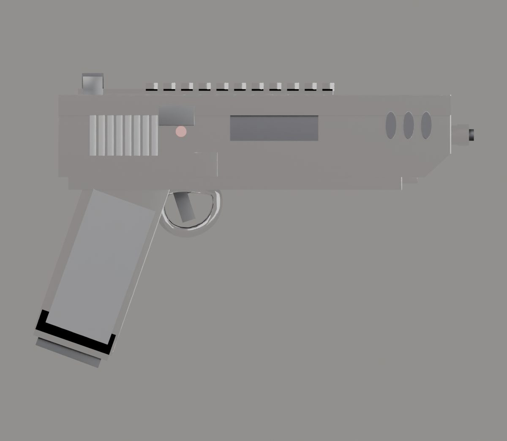

# İçe aktarma raporu: d50

- Kaynak: `SourceAssets/Weapons/d50/original/golden_dessert_eagle_1.blend`
- Çıktı: `web/assets/weapons/d50.glb` (270 KB)
- Üçgen: 113096 → 10596
- Uygulanan ölçek: 0.623 (uzunluk 0.449 m → 0.280 m)
- Parçalar: gövde + mag, slide
- Doku: yok (yalnızca PBR renk malzemeleri)
- Oyun koordinatlarında noktalar: `{"muzzle": [0.0, 0.0405, -0.218], "sight": [0.0, 0.0772, 0.023], "leftHand": [-0.0187, -0.0374, 0.023], "eject": [0.015, 0.0467, -0.0922]}`

