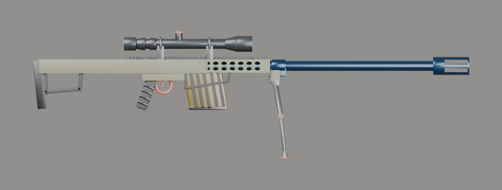

# İçe aktarma raporu: m82

- Kaynak: `SourceAssets/Weapons/m82/original/marret_m82.blend`
- Çıktı: `web/assets/weapons/m82.glb` (443 KB)
- Üçgen: 22278 → 17276
- Uygulanan ölçek: 1.000 (uzunluk 1.425 m → 1.425 m)
- Parçalar: gövde + charging, mag
- Doku: yok (yalnızca PBR renk malzemeleri)
- Oyun koordinatlarında noktalar: `{"muzzle": [0.0, 0.04, -1.05], "sight": [-0.0, 0.112, 0.082], "leftHand": [0.0, 0.005, -0.23], "eject": [0.03, 0.052, -0.1]}`

