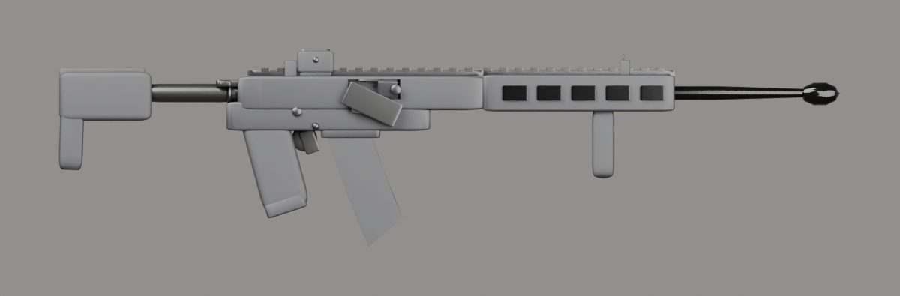

# İçe aktarma raporu: mar556

- Kaynak: `SourceAssets/Weapons/mar556/original/mar_556_1.blend`
- Çıktı: `web/assets/weapons/mar556.glb` (656 KB)
- Üçgen: 217320 → 29256
- Uygulanan ölçek: 0.784 (uzunluk 1.250 m → 0.980 m)
- Parçalar: gövde + charging, mag, optic
- Doku: yok (yalnızca PBR renk malzemeleri)
- Oyun koordinatlarında noktalar: `{"muzzle": [0.0, 0.0423, -0.7006], "sight": [0.0, 0.0901, -0.0227], "leftHand": [0.0, -0.0274, -0.4005], "eject": [0.0313, 0.047, -0.1113]}`

