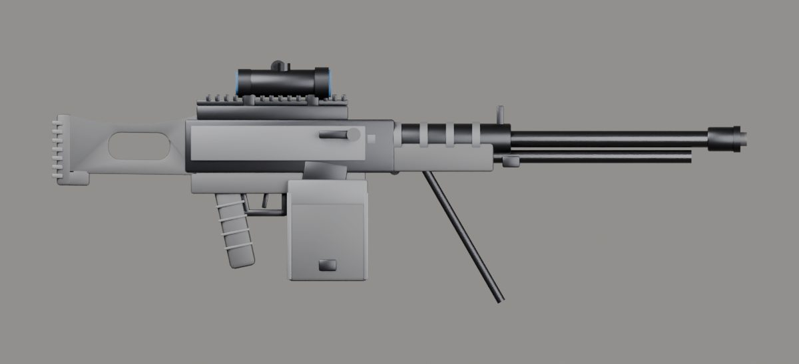

# İçe aktarma raporu: mg43

- Kaynak: `SourceAssets/Weapons/mg43/original/mg_43_1.blend`
- Çıktı: `web/assets/weapons/mg43.glb` (314 KB)
- Üçgen: 11268 → 11268
- Uygulanan ölçek: 1.000 (uzunluk 1.193 m → 1.193 m)
- Parçalar: gövde + charging, mag, optic
- Doku: yok (yalnızca PBR renk malzemeleri)
- Oyun koordinatlarında noktalar: `{"muzzle": [0.0, 0.082, -0.872], "sight": [-0.0, 0.178, 0.006], "leftHand": [0.0, 0.02, -0.336], "eject": [0.034, 0.088, -0.166]}`

