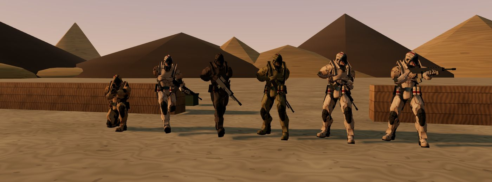

# İçe aktarma raporu: soldier

- Kaynak: `SourceAssets/Characters/soldier_vanguard/original/Soldier.glb` (three.js örnek deposu, Mixamo "Vanguard")
- Çıktı: `web/assets/characters/soldier.glb` (682 KB) + `soldier_diffuse.jpg` (290 KB) + `soldier_normal.jpg` (357 KB)
- Üçgen: 11.376 (gövde + vizör), 49 kemikli iskelet (Mixamo adlandırması, önek silindi)
- Klipler: Idle (1,97 s), Walk (1,03 s), Run (0,70 s). T-poz atıldı.
- Ölçülen yer hızları: yürüyüş 1,65 m/s (döngü 1,70 m), koşu 4,2 m/s (döngü 2,94 m) → `config.js` `SOLDIER_ANIM`
- Bekleme klibinde kalça ~45°, omuzlar ~17° sağa dönük durur; göğüs ve baş oyunda bakış yönüne düzeltilir.
- Oyunda eklenenler: iki elle silah tutuşu (kol IK), parmak kavraması, nişan / hazır / rahat duruşları, alt gövdenin hareket yönüne dönmesi, geri geri yürüme, yerinde dönerken adım, çömelme (bacak IK), şarjör değiştirme, el bombası atma, geri tepme, isabette sarsılma, ölümde diz çöküp devrilme, kemiklere bağlı vuruş kutuları.
- Türler: tüfekçi (özgün renk), saldırgan (zeytin), ağır makineli (koyu, %12 iri), keskin nişancı (kum), poligon mankeni (turuncu)
- Lisans: Adobe Mixamo kullanım koşulları — bkz. `SourceAssets/Characters/soldier_vanguard/asset_info.json`

Soldan sağa: çömelmiş keskin nişancı, koşan tüfekçi, yürüyen ağır makineli, rahat duruşta saldırgan, şarjör değiştiren tüfekçi, nişan alan tüfekçi.
